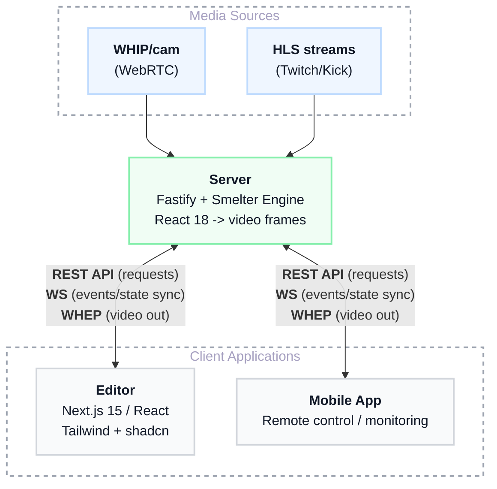

# Smelter Editor

Real-time video compositing studio built on [Smelter](https://github.com/swmansion/smelter). Combine live streams (Twitch, Kick), cameras (WebRTC/WHIP), local media, images, text overlays, and even a multiplayer Snake game — all mixed in configurable layouts with GPU-accelerated WGSL shaders and streamed out as WebRTC/WHEP.

## Architecture



- **`editor/`** — Web UI (Next.js 15, App Router, React 19, Tailwind 4, shadcn/ui) for managing rooms, inputs, layouts, and shaders.
- **`server/`** — Fastify API + Smelter rendering engine. Renders React 18 components (`<View>`, `<InputStream>`, `<Shader>`) directly to video frames — not the DOM.

## Features

- **7 input types** — Twitch channel, Kick channel, WHIP (camera/screenshare), local MP4, image, text overlay, Snake game
- **7 layout modes** — grid, primary-on-left, primary-on-top, picture-in-picture, wrapped, wrapped-static, picture-on-picture
- **Absolute positioning** — pull inputs out of layouts and place them at arbitrary pixel positions with animated transitions (duration, easing)
- **21 GPU shaders** — grayscale, ASCII filter, hologram, perspective warp, sine wave, soft shadow, orbiting, star streaks, brightness/contrast, alpha stroke, opacity, circle mask, grid overlay, page flip, color removal, snake event highlight, blur, HSL adjust, vignette, chromatic aberration, sharpen (WGSL)
- **Motion detection** — real-time per-input motion scoring via Python + OpenCV, with SSE streaming, per-input charts, and inline indicators
- **Room-based** — multiple independent compositing rooms, each with its own inputs, layout, and output stream
- **News strip** — animated scrolling news/ticker overlay on video output with fade-during-swap support
- **Transitions** — primary input swap transitions with configurable fade-in/fade-out durations
- **Recording** — per-room MP4 recording with automatic cleanup
- **Customizable dashboard** — drag-and-drop panel layout (react-grid-layout) with presets (Default, Wide Video, Compact, Equal Split, Vertical Video), per-panel visibility toggles, and dynamic motion panels per input
- **Server-side storage** — generic CRUD for room configs, shader presets, and dashboard layouts with save/load/delete modals
- **Voice commands** — speech-to-text command system with macros
- **Room config export/import** — save and restore full room configurations as JSON (local file or server)
- **Keyboard shortcuts** — keyboard-driven workflow support
- **Snake game input** — multiplayer Snake rendered as a video input with event-driven shader effects and per-player shader presets
- **Input renderer registry** — pluggable input type rendering system

## Prerequisites

- **Node.js** >= 20
- **pnpm**
- **GPU** (recommended) — NVIDIA or AMD for hardware-accelerated rendering. Falls back to CPU if no GPU is available.
- **streamlink** — for ingesting Twitch/Kick HLS streams (`pipx install streamlink`)
- **ffmpeg**
- **Python 3** + `opencv-python-headless` + `numpy` — for motion detection (auto-installed into `server/motion/.venv/` on first use, or install globally: `pip3 install opencv-python-headless numpy`)

## Quick Start

### Local development

1. **Install dependencies**

```bash
# Editor
cd editor && pnpm install

# Server
cd server && pnpm install
```

2. **Configure environment**

```bash
# editor/.env.local
SMELTER_EDITOR_SERVER_URL=http://localhost:3001

# server/.env.local
TWITCH_CLIENT_ID=...
TWITCH_CLIENT_SECRET=...
KICK_CLIENT_ID=...
KICK_CLIENT_SECRET=...
```

3. **Start the server**

```bash
cd server
pnpm start          # Starts Fastify + Smelter on port 3001
```

4. **Start the editor**

```bash
cd editor
pnpm dev             # Next.js dev server with Turbopack
```

Open [http://localhost:3000](http://localhost:3000) in your browser.

### Docker (production)

Requires an NVIDIA GPU with the [NVIDIA Container Toolkit](https://docs.nvidia.com/datacenter/cloud-native/container-toolkit/install-guide.html) installed.

1. Create a `secret.env` file with your API credentials:

```env
TWITCH_CLIENT_ID=...
TWITCH_CLIENT_SECRET=...
KICK_CLIENT_ID=...
KICK_CLIENT_SECRET=...
```

2. Build and run:

```bash
docker compose up --build
```

For AMD GPUs, uncomment the `devices` section and comment out `gpus`/`runtime` in `compose.yaml`.

**Exposed ports:**
| Port | Protocol | Description |
|------|----------|-------------|
| 9071 | HTTP | REST API |
| 9072 | HTTP | WHEP/WHIP (WebRTC) |

## Development Commands

### Editor (`cd editor/`)

| Command           | Description             |
| ----------------- | ----------------------- |
| `pnpm dev`        | Dev server (Turbopack)  |
| `pnpm build`      | Production build        |
| `pnpm lint --fix` | ESLint + Prettier       |
| `pnpm test`       | Run vitest (watch mode) |
| `pnpm test:run`   | Run vitest once (CI)    |

### Server (`cd server/`)

| Command      | Description           |
| ------------ | --------------------- |
| `pnpm start` | Run with ts-node      |
| `pnpm build` | Compile TypeScript    |
| `pnpm watch` | TypeScript watch mode |

## Environment Variables

| Variable                                | Where  | Description                                                        |
| --------------------------------------- | ------ | ------------------------------------------------------------------ |
| `SMELTER_EDITOR_SERVER_URL`             | editor | Server URL (e.g. `http://localhost:3001`)                          |
| `SMELTER_DEMO_API_PORT`                 | server | API port (default: `3001`)                                         |
| `TWITCH_CLIENT_ID`                      | server | Twitch API client ID                                               |
| `TWITCH_CLIENT_SECRET`                  | server | Twitch API client secret                                           |
| `KICK_CLIENT_ID`                        | server | Kick API client ID                                                 |
| `KICK_CLIENT_SECRET`                    | server | Kick API client secret                                             |
| `ENVIRONMENT`                           | server | `production` enables Vulkan encoder and production WHEP/WHIP URLs  |
| `LAYOUT`                                | server | `boxed` enables the blessed TUI dashboard                          |
| `SMELTER_SNAKE_VISUAL_SPEED_MULTIPLIER` | server | Snake interpolation speed (default: `1.25`)                        |
| `MOTION_PYTHON_PATH`                    | server | Override Python binary for motion detection (default: auto-detect) |

## Project Structure

```
├── editor/                    # Next.js web UI
│   ├── app/
│   │   ├── actions/           # Server actions (API calls)
│   │   ├── api/game-state/    # Game state proxy
│   │   ├── kick/              # Kick integration pages
│   │   ├── raw-preview/       # Raw video preview page
│   │   ├── room/[roomId]/     # Room page
│   │   ├── room-preview/      # Room preview page
│   │   └── rooms/             # Rooms list page
│   ├── components/
│   │   ├── control-panel/     # Input, layout, shader controls
│   │   ├── dashboard/         # Drag-and-drop panel layout system
│   │   ├── pages/             # Page-level components (intro, room)
│   │   ├── room-page/         # Room view + WHEP player
│   │   ├── ui/                # shadcn/ui components
│   │   └── voice-action-feedback/ # Voice command feedback overlay
│   ├── hooks/                 # Custom React hooks (motion-scores, motion-history)
│   ├── lib/
│   │   ├── types/             # Shared TypeScript types
│   │   ├── voice/             # Speech-to-text commands
│   │   ├── webrtc/            # WebRTC client utilities
│   │   ├── api-client.ts      # API client interface
│   │   ├── api-context.tsx    # API context provider
│   │   ├── storage-client.ts  # Generic storage CRUD client
│   │   ├── room-config.ts     # Config export/import
│   │   ├── resolution.ts      # Resolution presets
│   │   ├── snake-game-types.ts # Snake game type definitions
│   │   ├── snake-events.ts    # Snake event labels/descriptions
│   │   ├── snake-shader-presets.ts      # Visual shader presets
│   │   ├── snake-event-effect-presets.ts # Per-event effect presets
│   │   └── timeline-storage.ts # Timeline state persistence
│   └── utils/                 # Utility functions (animations)
├── server/                    # Fastify + Smelter engine
│   ├── src/
│   │   ├── app/
│   │   │   ├── layouts/       # Layout React components
│   │   │   ├── news-strip/    # Scrolling news strip overlay
│   │   │   ├── transitions/   # Input swap transition hooks
│   │   │   ├── App.tsx        # Root rendering component
│   │   │   └── store.ts       # Zustand store (per room)
│   │   ├── inputs/            # Input rendering + renderer registry
│   │   ├── motion/            # Motion detection (MotionManager, MotionScene)
│   │   ├── snakeGame/         # Snake game module
│   │   ├── server/            # Fastify routes, room/server state, storage routes
│   │   ├── shaders/           # Shader definitions
│   │   ├── types/             # Shared TypeScript types
│   │   ├── twitch/            # Twitch integration
│   │   ├── kick/              # Kick integration
│   │   ├── whip/              # WHIP input monitor
│   │   ├── mp4/               # MP4 asset management
│   │   ├── pictures/          # Image asset management
│   │   └── utils/             # Server utilities
│   ├── motion/                # Python motion detector script + requirements
│   ├── configs/               # Saved room configurations
│   ├── shader-presets/        # Saved shader presets
│   ├── dashboard-layouts/     # Saved dashboard layouts
│   ├── shaders/               # WGSL shader source files
│   ├── mp4s/                  # Static MP4 assets
│   ├── pictures/              # Static image assets
│   ├── imgs/                  # Logo and other images
│   ├── fonts/                 # Font files
│   └── recordings/            # Recorded MP4 outputs
├── compose.yaml               # Docker Compose config
├── Dockerfile                 # Production container
└── entrypoint.sh
```

## License

MIT
