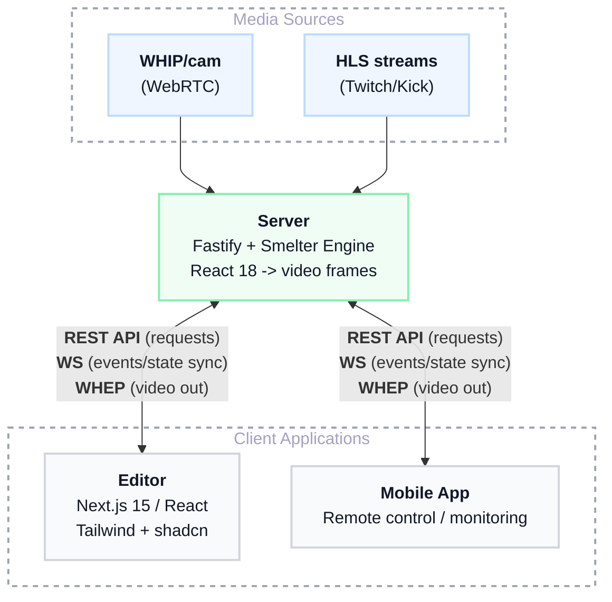

# Smelter Editor

Real-time video compositing studio built on [Smelter](https://github.com/swmansion/smelter). Combine live streams (Twitch, Kick), cameras (WebRTC/WHIP), local media, images, text overlays, and even a multiplayer Snake game — all mixed in configurable layouts with GPU-accelerated WGSL shaders and streamed out as WebRTC/WHEP.

## Architecture


```mermaid
%%{init: {'flowchart': {'curve': 'monotoneY'}} }%%
flowchart TD
    %% Media Inputs Subgraph
    subgraph Sources ["Media Sources"]
        WHIP["<b>WHIP/cam</b><br/>(WebRTC)"]
        HLS["<b>HLS streams</b><br/>(Twitch/Kick)"]
    end

    %% Core Server (Middle)
    Server["<b>Server</b><br/>Fastify + Smelter Engine<br/>React 18 -> video frames"]

    %% Clients Subgraph
    subgraph Clients ["Client Applications"]
        Editor["<b>Editor</b><br/>Next.js 15 / React<br/>Tailwind + shadcn"]
        Mobile["<b>Mobile App</b><br/>Remote control / monitoring"]
    end

    %% Flow of external media into the server
    WHIP --> Server
    HLS --> Server

    %% Grouped bidirectional client connections
    Server <-->|"<b>REST API</b> (requests)<br/><b>WS</b> (events/state sync)<br/><b>WHEP</b> (video out)"| Editor
    Server <-->|"<b>REST API</b> (requests)<br/><b>WS</b> (events/state sync)<br/><b>WHEP</b> (video out)"| Mobile

    %% Node Styling
    style Editor fill:#f9fafb,stroke:#d1d5db,stroke-width:2px,color:#111827
    style Mobile fill:#f9fafb,stroke:#d1d5db,stroke-width:2px,color:#111827
    style Server fill:#f0fdf4,stroke:#86efac,stroke-width:2px,color:#111827
    style WHIP fill:#eff6ff,stroke:#bfdbfe,stroke-width:2px,color:#111827
    style HLS fill:#eff6ff,stroke:#bfdbfe,stroke-width:2px,color:#111827

    %% Subgraph Styling
    style Sources fill:none,stroke:#9ca3af,stroke-width:2px,stroke-dasharray: 5 5,color:#a7a1c1
    style Clients fill:none,stroke:#9ca3af,stroke-width:2px,stroke-dasharray: 5 5,color:#a7a1c1
```

- **`editor/`** — Web UI (Next.js 15, App Router, React 19, Tailwind 4, shadcn/ui) for managing rooms, inputs, layouts, and shaders.
- **`server/`** — Fastify API + Smelter rendering engine. Renders React 18 components (`<View>`, `<InputStream>`, `<Shader>`) directly to video frames — not the DOM.

## Features

- **9 input types** — Twitch channel, Kick channel, HLS stream, WHIP (camera/screenshare), local MP4 (video or audio), image, text overlay, Snake game, hands tracking
- **7 layout modes** — grid, primary-on-left, primary-on-top, picture-in-picture, wrapped, wrapped-static, picture-on-picture
- **Absolute positioning** — pull inputs out of layouts and place them at arbitrary pixel positions with animated transitions (duration, easing)
- **21 GPU shaders** — grayscale, ASCII filter, hologram, perspective warp, sine wave, soft shadow, orbiting, star streaks, brightness/contrast, alpha stroke, opacity, circle mask, grid overlay, page flip, color removal, snake event highlight, blur, HSL adjust, vignette, chromatic aberration, sharpen (WGSL)
- **Live captions** — real-time speech-to-text (Whisper) on video inputs with audio: MP4, HLS, Twitch, Kick, WHIP; rendered as live caption overlays on the composited output
- **Motion detection** — real-time per-input motion scoring via Python + OpenCV, with SSE streaming, per-input charts, and inline indicators
- **Room-based** — multiple independent compositing rooms, each with its own inputs, layout, and output stream
- **News strip** — animated scrolling news/ticker overlay on video output with fade-during-swap support
- **Transitions** — primary input swap transitions with configurable fade-in/fade-out durations
- **Recording** — per-room MP4 recording with automatic cleanup
- **Customizable dashboard** — drag-and-drop panel layout (react-grid-layout) with presets (Default, Wide Video, Compact, Equal Split, Vertical Video), per-panel visibility toggles, dynamic motion panels per input, and a Captions panel for bulk transcription toggles
- **Server-side storage** — generic CRUD for room configs, shader presets, and dashboard layouts with save/load/delete modals
- **Voice commands** — speech-to-text command system with macros
- **Room config export/import** — save and restore full room configurations as JSON (local file or server)
- **Keyboard shortcuts** — keyboard-driven workflow support
- **Snake game input** — multiplayer Snake rendered as a video input with event-driven shader effects and per-player shader presets
- **Input renderer registry** — pluggable input type rendering system

## Prerequisites

- **Node.js** >= 20
- **pnpm**
- **GPU** (recommended) — NVIDIA or AMD for hardware-accelerated rendering. Falls back to CPU if no GPU is available.
- **streamlink** — for ingesting Twitch/Kick HLS streams (`pipx install streamlink`)
- **ffmpeg**
- **Python 3** + `opencv-python-headless` + `numpy` — for motion detection (auto-installed into `server/motion/.venv/` on first use, or install globally: `pip3 install opencv-python-headless numpy`)
- **Python 3** + Whisper sidecar deps — for live captions (auto-installed into `server/captions/.venv/` on first use; see [Captions](#live-captions)). Docker image bakes the venv at build time.
- **macOS only** — run `server/scripts/setup-macos.sh` once per boot before starting the server. It raises `net.local.stream.{send,recv}space` so Smelter's side channels can deliver video/audio frames to the Python workers. Without it, AI models and captions log `subscribe_video_channel ... returned 0 frames` and never produce output. These sysctls reset to their too-small default on every reboot.

## Quick Start

### Local development

1. **Install dependencies**

```bash
# Editor
cd editor && pnpm install

# Server
cd server && pnpm install
```

2. **Configure environment**

```bash
# editor/.env.local
SMELTER_EDITOR_SERVER_URL=http://localhost:3001

# server/.env.local
TWITCH_CLIENT_ID=...
TWITCH_CLIENT_SECRET=...
KICK_CLIENT_ID=...
KICK_CLIENT_SECRET=...
```

3. **Start the server**

```bash
cd server
pnpm start          # Starts Fastify + Smelter on port 3001
```

4. **Start the editor**

```bash
cd editor
pnpm dev             # Next.js dev server with Turbopack
```

Open [http://localhost:3000](http://localhost:3000) in your browser.

### Docker (production)

Requires an NVIDIA GPU with the [NVIDIA Container Toolkit](https://docs.nvidia.com/datacenter/cloud-native/container-toolkit/install-guide.html) installed.

1. Create a `secret.env` file with your API credentials:

```env
TWITCH_CLIENT_ID=...
TWITCH_CLIENT_SECRET=...
KICK_CLIENT_ID=...
KICK_CLIENT_SECRET=...
```

2. Set a host data directory (required — `compose.yaml` bind-mounts persistent room assets here):

```bash
export SMELTER_DATA_DIR=/path/to/smelter-data   # absolute path on the host
```

3. Build and run:

```bash
docker compose up --build
```

For AMD GPUs, uncomment the `devices` section and comment out `gpus`/`runtime` in `compose.yaml`.

**Exposed ports:**
| Port | Protocol | Description |
|------|----------|-------------|
| 9071 | HTTP | REST API |
| 9072 | HTTP | WHEP/WHIP (WebRTC) |

### Docker (development — hot reload)

Use `compose.dev.yaml` as an overlay to bind-mount server sources into the container. Smelter base image, `node_modules`, ffmpeg, and the Whisper Python venv stay baked in — no full image rebuild for TypeScript edits.

**First time, or after Dockerfile / dependency changes:**

```bash
SMELTER_DATA_DIR=/path/to/smelter-data docker compose -f compose.yaml -f compose.dev.yaml up --build
```

**Day-to-day (TypeScript / WGSL only):**

```bash
SMELTER_DATA_DIR=/path/to/smelter-data docker compose -f compose.yaml -f compose.dev.yaml up
```

The dev entrypoint (`entrypoint.dev.sh`) builds `@smelter-editor/types`, runs `pnpm dev` + `pnpm watch`, and starts the server with `node --watch dist/index.js`.

**After editing `server/captions/sidecar.py`:**

```bash
docker compose -f compose.yaml -f compose.dev.yaml restart server
```

Python sidecar code is read at container boot; a restart is enough (no rebuild).

**What is mounted vs baked:**

| Mounted (live) | Baked in image |
| --- | --- |
| `server/src/` | Smelter base, `node_modules` |
| `packages/types/src/` | Whisper `.venv` (via named volume `captions_venv`) |
| `server/shaders/` | ffmpeg, system Python |
| `server/captions/sidecar.py` | |
| `entrypoint.dev.sh` | |

**Notes:**

- `compose.dev.yaml` disables NVIDIA GPU runtime and uses FFmpeg CPU encoding — suitable for macOS and CPU-only Linux dev.
- On Linux with NVIDIA GPU, adjust or remove the `runtime`/`gpus` overrides in `compose.dev.yaml` if you want GPU encoding in dev.
- Do not merge `compose.cpu.yaml` with `compose.dev.yaml` as-is — `compose.cpu.yaml` references an orphan `server-b` service. Dev CPU overrides are included directly in `compose.dev.yaml`.
- The editor is **not** run in Docker (excluded via `.dockerignore`); run `pnpm dev` in `editor/` locally and point `SMELTER_EDITOR_SERVER_URL` at `http://localhost:9071`.

**Performance (Docker dev is slower than native — especially on macOS):**

Docker dev trades speed for environment parity. On macOS there is **no GPU passthrough** for Smelter — WGSL compositing and H.264 encoding run on CPU inside a Linux VM, which is often 2–5× slower than `cd server && pnpm start` natively (Metal/GPU on the host).

| Approach | When to use |
| --- | --- |
| **Native** (`server`: `pnpm start`, `editor`: `pnpm dev`) | Day-to-day dev, best preview latency |
| **Docker dev** (`compose.dev.yaml`) | Hot reload without image rebuild, Linux/prod-like deps |
| **Docker dev + perf overlay** (`compose.dev.perf.yaml`) | Docker dev but lighter CPU load |

```bash
# Lighter Docker dev (no Whisper sidecar, lower bitrate, ts-node):
SMELTER_DATA_DIR=/path/to/smelter-data docker compose \
  -f compose.yaml -f compose.dev.yaml -f compose.dev.perf.yaml up
```

Other tweaks without the perf overlay:

- `SKIP_PYTHON=1` — skip Whisper sidecar when not testing captions (already in `CaptionBridge`)
- Lower `SMELTER_H264_ENCODER_BITRATE` (e.g. `8000000`) in `compose.dev.yaml`
- Docker Desktop → Settings → Resources: give the VM more CPUs (8+) and RAM (8 GB+)
- On **Linux + NVIDIA**: remove `runtime`/`gpus` overrides from `compose.dev.yaml` to use Vulkan encoder

### Network verification (API + WHEP/WHIP)

Replace `<host>` with the machine IP or DNS name from another machine on the network:

```bash
# API checks
curl -fsS "http://<host>:9071/active-rooms"

# Port reachability checks (WHEP/WHIP + API)
nc -vz <host> 9071
nc -vz <host> 9072
```

Make sure firewall/security group rules allow inbound TCP on ports `9071` and `9072`.

## Live captions

Real-time speech-to-text using a Python Whisper sidecar (`server/captions/sidecar.py`) fed by Smelter's audio side channel. Transcripts are rendered as caption overlays on the composited video output.

### Supported input types

Captions work on any input type that carries audio:

| Input type | Notes |
| --- | --- |
| `local-mp4` | Video or audio-only MP4 |
| `hls` | Generic HLS stream |
| `twitch-channel` | Twitch HLS via streamlink |
| `kick-channel` | Kick HLS via streamlink |
| `whip` | Camera / screenshare (WebRTC) |

Not supported: `image`, `text-input`, `game`, `hands` (no audio track).

### Enabling captions

**Editor UI:**

- **Add input** — check "Captions" when adding MP4, audio, Twitch, Kick, or HLS inputs (`CaptionsCheckbox` in the add-input modal).
- **Existing input** — toggle Captions On/Off inline in the input list, or use the **Captions** dashboard panel (default layout includes it).

**API:**

```http
POST /room/:roomId/input/:inputId/transcription
Content-Type: application/json

{ "enabled": true }
```

Pass `transcription: true` when registering inputs (`POST /room/:roomId/input/...`) or include it in room config export/import JSON.

### How it works

1. When `transcription: true`, Smelter registers the input with `sideChannel: { audio: true, delayMs: 8000 }`.
2. A hidden pull scene (`CaptionsScene` / `CaptionsSideChannelDecode` in `App.tsx`) keeps `InputStream`s alive so side-channel audio is decoded without affecting main mix volumes.
3. `CaptionBridge` spawns `sidecar.py`, which runs faster-whisper + Silero VAD per active input.
4. Transcripts flow back over WebSocket → `RoomState.applyTranscript()` → Zustand store → caption overlay in `inputs.tsx`.

WHIP inputs wait for `side_channel_ready` on the WHIP ack before notifying the sidecar; other types notify immediately after connect.

### Python setup (local dev)

On first use the server auto-creates `server/captions/.venv/` and installs from `requirements-cpu.txt` (CPU PyTorch). For CUDA PyTorch set `CAPTIONS_USE_CUDA_TORCH=1` before first venv creation, or point to an existing venv with `CAPTIONS_PYTHON_PATH`.

### Known limitations

- **Toggle on connected input** — side channel is configured at `registerInput` time; toggling captions on an already-connected input triggers a reconnect.
- **MP4 loop** — looping MP4 may re-transcribe the same audio on each loop.
- **Python sidecar restart** — in Docker dev mode, edits to `sidecar.py` require `docker compose ... restart server`.

## Development Commands

### Editor (`cd editor/`)

| Command           | Description             |
| ----------------- | ----------------------- |
| `pnpm dev`        | Dev server (Turbopack)  |
| `pnpm build`      | Production build        |
| `pnpm lint --fix` | ESLint + Prettier       |
| `pnpm test`       | Run vitest (watch mode) |
| `pnpm test:run`   | Run vitest once (CI)    |

### Server (`cd server/`)

| Command      | Description           |
| ------------ | --------------------- |
| `pnpm start` | Run with ts-node      |
| `pnpm build` | Compile TypeScript    |
| `pnpm watch` | TypeScript watch mode |

## Environment Variables

| Variable                                | Where  | Description                                                        |
| --------------------------------------- | ------ | ------------------------------------------------------------------ |
| `SMELTER_EDITOR_SERVER_URL`             | editor | Server URL (e.g. `http://localhost:3001`)                          |
| `SMELTER_DEMO_API_PORT`                 | server | API port (default: `3001`)                                         |
| `TWITCH_CLIENT_ID`                      | server | Twitch API client ID                                               |
| `TWITCH_CLIENT_SECRET`                  | server | Twitch API client secret                                           |
| `KICK_CLIENT_ID`                        | server | Kick API client ID                                                 |
| `KICK_CLIENT_SECRET`                    | server | Kick API client secret                                             |
| `ENVIRONMENT`                           | server | `production` enables Vulkan encoder and production WHEP/WHIP URLs  |
| `LAYOUT`                                | server | `boxed` enables the blessed TUI dashboard                          |
| `SMELTER_WS_DEBUG`                      | server | `true` enables detailed WebSocket upgrade/connection debug logs    |
| `SMELTER_SNAKE_VISUAL_SPEED_MULTIPLIER` | server | Snake interpolation speed (default: `1.25`)                        |
| `MOTION_PYTHON_PATH`                    | server | Override Python binary for motion detection (default: auto-detect) |
| `CAPTIONS_PYTHON_PATH`                  | server | Override Python binary for captions sidecar (default: auto-detect venv) |
| `CAPTIONS_USE_CUDA_TORCH`               | server | Set to `1` to install CUDA PyTorch into captions venv (default: CPU) |
| `CAPTIONS_WS_PORT`                      | server | WebSocket port for sidecar ↔ Node bridge (default: `8082`) |
| `CAPTIONS_DEBUG`                        | server | Set to `1` for verbose caption logging |
| `SMELTER_DATA_DIR`                      | docker | Absolute host path for persistent room data (required in `compose.yaml`) |

## Project Structure

```
├── editor/                    # Next.js web UI
│   ├── app/
│   │   ├── actions/           # Server actions (API calls)
│   │   ├── api/game-state/    # Game state proxy
│   │   ├── kick/              # Kick integration pages
│   │   ├── raw-preview/       # Raw video preview page
│   │   ├── room/[roomId]/     # Room page
│   │   ├── room-preview/      # Room preview page
│   │   └── rooms/             # Rooms list page
│   ├── components/
│   │   ├── control-panel/     # Input, layout, shader controls
│   │   ├── dashboard/         # Drag-and-drop panel layout system
│   │   ├── pages/             # Page-level components (intro, room)
│   │   ├── room-page/         # Room view + WHEP player
│   │   ├── ui/                # shadcn/ui components
│   │   └── voice-action-feedback/ # Voice command feedback overlay
│   ├── hooks/                 # Custom React hooks (motion-scores, motion-history)
│   ├── lib/
│   │   ├── types/             # Shared TypeScript types
│   │   ├── voice/             # Speech-to-text commands
│   │   ├── webrtc/            # WebRTC client utilities
│   │   ├── api-client.ts      # API client interface
│   │   ├── api-context.tsx    # API context provider
│   │   ├── storage-client.ts  # Generic storage CRUD client
│   │   ├── room-config.ts     # Config export/import
│   │   ├── resolution.ts      # Resolution presets
│   │   ├── snake-game-types.ts # Snake game type definitions
│   │   ├── snake-events.ts    # Snake event labels/descriptions
│   │   ├── snake-shader-presets.ts      # Visual shader presets
│   │   ├── snake-event-effect-presets.ts # Per-event effect presets
│   │   └── timeline-storage.ts # Timeline state persistence
│   └── utils/                 # Utility functions (animations)
├── server/                    # Fastify + Smelter engine
│   ├── src/
│   │   ├── app/
│   │   │   ├── layouts/       # Layout React components
│   │   │   ├── transitions/   # Input swap transition hooks
│   │   │   ├── App.tsx        # Root rendering component
│   │   │   └── store.ts       # Zustand store (per room)
│   │   ├── inputs/            # Input rendering + renderer registry
│   │   ├── motion/            # Motion detection (MotionManager, MotionScene)
│   │   ├── captions/          # Live captions (CaptionBridge, CaptionsScene, sidecar WS)
│   │   ├── snakeGame/         # Snake game module
│   │   ├── server/            # Fastify routes, room/server state, storage routes
│   │   ├── shaders/           # Shader definitions
│   │   ├── types/             # Shared TypeScript types
│   │   ├── twitch/            # Twitch integration
│   │   ├── kick/              # Kick integration
│   │   ├── whip/              # WHIP input monitor
│   │   ├── mp4/               # MP4 asset management
│   │   ├── pictures/          # Image asset management
│   │   └── utils/             # Server utilities
│   ├── motion/                # Python motion detector script + requirements
│   ├── captions/              # Python Whisper sidecar (sidecar.py) + requirements
│   ├── configs/               # Saved room configurations
│   ├── shader-presets/        # Saved shader presets
│   ├── dashboard-layouts/     # Saved dashboard layouts
│   ├── shaders/               # WGSL shader source files
│   ├── mp4s/                  # Static MP4 assets
│   ├── pictures/              # Static image assets
│   ├── imgs/                  # Logo and other images
│   ├── fonts/                 # Font files
│   └── recordings/            # Recorded MP4 outputs
├── compose.yaml               # Docker Compose config (production)
├── compose.dev.yaml           # Dev overlay: bind-mount sources, CPU encoder, hot reload
├── compose.cpu.yaml           # CPU encoder overrides (production CPU-only; do not merge with compose.dev.yaml)
├── Dockerfile                 # Production container
├── entrypoint.sh              # Production entrypoint
└── entrypoint.dev.sh          # Dev entrypoint (tsc watch + node --watch)
```

## Example AI prompts

Example prompt for generating carousel functionality in the layer system:

```
Add carousel to the layer system.
A layer shows one slide at a time with animated transitions
— configurable: duration, easing, visible slide count, gap.
Server: carousel action endpoint (next/prev/setIndex)
with debounce during animation and index wrap-around.
Rendering component with slide animation and overflow hidden.
State bounds sanitization.
Editor: carousel action API,
keyboard hook (←/→/Space),
clap detection hook via mic (2-5kHz).
UI: creation modal with input selection,
inline settings (duration, visible count, gap, easing,
position/size, keyboard/clap toggles with localStorage),
slide selection dialog.
"Carousel" label and settings/edit buttons in layer header.
```

## License

MIT
