# Smelter Editor — Dependency Graph

```mermaid
flowchart TD
    subgraph Pages["Strony Next.js App Router"]
        RL["app/layout.tsx"]
        HP["app/page.tsx - Home"]
        RP["app/room/roomId/page.tsx"]
        RPV["app/room-preview"]
    end

    subgraph APIRoutes["API Routes"]
        ARAR["api/active-rooms"]
        ARGS["api/game-state"]
        ARREC["api/recordings"]
        ARWHIP["api/whip-ack"]
    end

    subgraph ServerActions["Server Actions"]
        ACT["actions.ts"]
    end

    subgraph APILayer["Warstwa API"]
        APIC["api-client.ts"]
        APICTX["api-context.tsx"]
    end

    subgraph Types["System typów"]
        TI["types/index.ts"]
        TINPUT["types/input.ts"]
        TROOM["types/room.ts"]
        TLAYOUT["types/layout.ts"]
        TSHADER["types/shader.ts"]
        GT["game-types.ts"]
        RES["resolution.ts"]
    end

    subgraph Views["Widoki"]
        IV["IntroView"]
        RV["RoomView"]
        RMP["RoomPage"]
    end

    subgraph Dashboard["Dashboard"]
        DL["DashboardLayout"]
        PR["panel-registry.ts"]
        PW["panel-wrapper.tsx"]
        LT["layout-toolbar.tsx"]
    end

    subgraph ControlPanel["Control Panel"]
        CP["control-panel.tsx"]
    end

    subgraph Contexts["Konteksty React"]
        ACTX["ActionsContext"]
        CPCTX["ControlPanelContext"]
        WHIPCTX["WhipConnectionsContext"]
        DA["default-actions.ts"]
    end

    subgraph Hooks["Hooki"]
        HCPS["use-control-panel-state"]
        HCPE["use-control-panel-events"]
        HRC["use-recording-controls"]
        HWC["use-whip-connections"]
        HTS["use-timeline-state"]
        HTP["use-timeline-playback"]
    end

    subgraph Sections["Sekcje Control Panel"]
        AVS["AddVideoSection"]
        SS["StreamsSection"]
        QAS["QuickActionsSection"]
        FXA["FxAccordion"]
        TP["TimelinePanel"]
        BCP["BlockClipPropertiesPanel"]
        TS["TransitionSettings"]
        CM["ConfigModals"]
        PWI["PendingWhipInputs"]
    end

    subgraph AddForms["Formularze inputów"]
        GAIF["generic-add-input-form"]
        TAIF["twitch-add-input-form"]
        KAIF["kick-add-input-form"]
        MAIF["mp4-add-input-form"]
        IAIF["image-add-input-form"]
        TXAIF["text-add-input-form"]
        WAIF["whip-add-input-form"]
        SAIF["screenshare-add-input-form"]
        GAMEAIF["game-add-input-form"]
        SB["suggestion-box"]
    end

    subgraph InputEntry["Input Entry"]
        IE["input-entry.tsx"]
        SP["shader-panel.tsx"]
        ASM["add-shader-modal"]
        SESP["snake-event-shader-panel"]
        IETS["input-entry-text-section"]
        DB["delete-button"]
        MB["mute-button"]
    end

    subgraph Sortable["Sortable List"]
        SL["sortable-list.tsx"]
        SItem["sortable-item.tsx"]
    end

    subgraph Video["Podgląd wideo"]
        VP["video-preview.tsx"]
        OS["output-stream.tsx"]
    end

    subgraph Voice["Komendy głosowe"]
        STTC["speech-to-text-with-commands"]
        VPC["parseCommand"]
        VDC["dispatchCommand"]
        VUC["useVoiceCommands"]
        VME["macroExecutor"]
        VMS["macroSettings"]
        VN["normalize"]
        VL["levenshtein"]
    end

    subgraph VoiceFB["Voice Feedback"]
        VAF["VoiceActionFeedback"]
    end

    subgraph Utils["Narzędzia"]
        UTILS["lib/utils.ts"]
        ANIM["animations.ts"]
        KB["keyboard.ts"]
        RC["room-config.ts"]
        TLS["timeline-storage.ts"]
        WEBRTC["webrtc/index.ts"]
        SE["snake-events.ts"]
        SSP["snake-shader-presets.ts"]
        SEEP["snake-event-effect-presets.ts"]
    end

    LS["layout-selector.tsx"]
    CLA["client-layout-addons.tsx"]
    RECL["recordings-list.tsx"]

    HP --> IV
    RP --> RMP
    RMP --> RV
    RL --> CLA
    CLA --> STTC
    CLA --> VAF
    IV --> ACT
    IV --> CM
    IV --> ACTX
    IV --> DA
    IV --> RECL
    IV --> RC
    IV --> RES
    RMP --> ACT
    RV --> VP
    RV --> CP
    RV --> DL
    DL --> PR
    DL --> PW
    DL --> LT
    CP --> ACTX
    CP --> DA
    CP --> CPCTX
    CP --> WHIPCTX
    CP --> HCPS
    CP --> HCPE
    CP --> HWC
    CP --> HRC
    CP --> AVS
    CP --> SS
    CP --> QAS
    CP --> FXA
    CP --> TP
    CP --> BCP
    CP --> TS
    CP --> CM
    CP --> PWI
    CP --> LS
    CP --> RC
    CP --> VMS
    AVS --> GAIF
    AVS --> TAIF
    AVS --> KAIF
    AVS --> MAIF
    AVS --> IAIF
    AVS --> TXAIF
    AVS --> WAIF
    AVS --> SAIF
    AVS --> GAMEAIF
    TAIF --> SB
    KAIF --> SB
    SS --> SL
    SS --> IE
    SL --> SItem
    IE --> SP
    IE --> SESP
    IE --> IETS
    IE --> DB
    IE --> MB
    IE --> ASM
    TP --> HTS
    TP --> HTP
    BCP --> HTS
    STTC --> VUC
    VUC --> VPC
    VUC --> VDC
    VUC --> VME
    VPC --> VN
    VPC --> VL
    VME --> VMS
    VP --> OS
    OS --> WEBRTC
    ACT --> APIC
    APIC --> TI
    DA --> ACT
    TI --> TINPUT
    TI --> TROOM
    TI --> TLAYOUT
    TI --> TSHADER
    GAMEAIF --> GT
    SESP --> GT
    SESP --> SE
    SESP --> SSP
    SESP --> SEEP
    RC --> TI
    RC --> GT
    RC --> TLS
    RC --> HTS
```

---

## Szczegółowe opisy komponentów

### Strony Next.js App Router

#### `app/layout.tsx` — Root Layout

> `editor/app/layout.tsx`

Główny layout Next.js. Ustawia fonty Geist (Sans + Mono), globalne style CSS, ciemne tło `#161127`. Renderuje `{children}` (strony) i `<ClientLayoutAddons />` (toast, voice, analytics). Metadata: title "Smelter Editor".

#### `app/page.tsx` — Strona główna

> `editor/app/page.tsx`

Prosta strona kliencka (`'use client'`). Punkt wejścia na `/`. Renderuje `<IntroView />`.

#### `app/room/[roomId]/page.tsx` — Strona pokoju

> `editor/app/room/[roomId]/page.tsx`

Dynamiczna trasa Next.js dla konkretnego pokoju. Parametr `roomId` z URL. Renderuje `<RoomPage />`.

#### `app/room-preview` — Tryb spektatora

> `editor/app/room-preview/[roomId]/page.tsx`

Tryb spectate — sam podgląd wideo WHEP bez control panelu.

---

### API Routes (proxy do serwera)

#### `api/active-rooms`

> `editor/app/api/active-rooms/`

Next.js API route proxy — zwraca listę aktywnych pokojów z serwera Smelter.

#### `api/game-state`

> `editor/app/api/game-state/`

API route proxy — przesyła stan gry Snake do serwera.

#### `api/recordings`

> `editor/app/api/recordings/`

API route proxy — pobieranie plików nagrań MP4 z serwera.

#### `api/whip-ack`

> `editor/app/api/whip-ack/`

API route proxy — potwierdzanie WHIP inputów (heartbeat liveness).

---

### Server Actions & warstwa API

#### `actions.ts` — Server Actions

> `editor/app/actions/actions.ts`

Plik `'use server'` — Next.js Server Actions. Tworzy singleton `SmelterApiClient` z `SMELTER_EDITOR_SERVER_URL` env.

Eksportuje ~30 funkcji:

- `createNewRoom()`, `deleteRoom()`, `updateRoom()`
- `addTwitchInput()`, `addKickInput()`, `addMP4Input()`, `addImageInput()`, `addTextInput()`, `addGameInput()`
- `updateInput()`, `removeInput()`, `disconnectInput()`, `connectInput()`
- `startRecording()`, `stopRecording()`, `getRecordings()`
- `getTwitchSuggestions()`, `getKickSuggestions()`, `getMP4Suggestions()`
- `getAvailableShaders()`, `getRoomInfo()`
- `setPendingWhipInputs()`, `acknowledgeWhipInput()`
- `restartService()` (sudo systemctl)

#### `api-client.ts` — SmelterApiClient

> `editor/lib/api-client.ts`

Klasa klienta HTTP implementująca interfejs `SmelterApiClient`. Wewnętrzny helper `sendSmelterRequest(path, method, body)` — fetch do serwera z automatycznym parsowaniem JSON. ~30 metod mapujących 1:1 na endpointy serwera Fastify.

#### `api-context.tsx` — SmelterApiProvider

> `editor/lib/api-context.tsx`

React Context dostarczający `SmelterApiClient` po stronie klienta. Eksportuje `SmelterApiProvider` i hook `useSmelterApi()`. Alternatywa dla server actions gdy potrzeba direct client-side calls.

---

### System typów

#### `types/index.ts` — Barrel export

> `editor/lib/types/index.ts`

Re-eksportuje wszystkie typy z 4 plików: `shader.ts`, `layout.ts`, `input.ts`, `room.ts`.

#### `types/input.ts` — Typy inputów

> `editor/lib/types/input.ts`

- `Input` — 7 typów: `local-mp4`, `twitch-channel`, `kick-channel`, `whip`, `image`, `text-input`, `game`
- `RegisterInputOptions`, `UpdateInputOptions`, `InputOrientation`

#### `types/room.ts` — Typy pokojów

> `editor/lib/types/room.ts`

`RoomState` (inputs, layout, whepUrl, resolution, recording state), `PendingWhipInputData`, `AddInputResponse`, `UpdateRoomOptions`, `RecordingInfo`, `SavedConfigInfo`, `RoomNameEntry`.

#### `types/layout.ts` — Typy layoutów

> `editor/lib/types/layout.ts`

Typ `Layout` — unia 9 wariantów: `grid`, `primary-on-left`, `primary-on-top`, `picture-in-picture`, `wrapped`, `wrapped-static`, `transition`, `picture-on-picture`, `softu-tv`.

#### `types/shader.ts` — Typy shaderów

> `editor/lib/types/shader.ts`

- `ShaderParam` — type: number|color, min/max/default
- `ShaderParamConfig` — paramId + paramValue (number|string)
- `ShaderConfig` — shaderId + params[]
- `AvailableShader` — id, name, description, params, icon SVG

**Uwaga:** `paramValue` jest `number | string` w edytorze (np. hex dla kolorów), `number` na serwerze.

#### `game-types.ts` — Typy gry Snake

> `editor/lib/game-types.ts`

Kanoniczne źródło typów gry w edytorze: `SnakeEventType`, `SnakeEventApplicationMode`, `SnakeEventShaderMapping`, `SnakeEventShaderConfig`. Re-eksportowane przez `actions.ts`.

#### `resolution.ts` — Presety rozdzielczości

> `editor/lib/resolution.ts`

`Resolution` ({width, height}), `ResolutionPreset` (720p, 1080p, 1440p + vertical), `RESOLUTION_PRESETS` mapping.

---

### Widoki

#### `IntroView` — Strona startowa

> `editor/components/pages/intro-view.tsx`

Strona powitalna (~620 linii):

- Pole Display Name (localStorage persist)
- Selektor rozdzielczości (landscape + portrait)
- Przycisk "Let's go!" → `createNewRoom()`
- Import konfiguracji z JSON (local file / remote via `LoadConfigModal`)
- Lista nagrań (`RecordingsList`)
- Lista aktywnych pokojów (polling 5s) z Join / Guest / Spectate / Delete
- Obsługa voice command `smelter:voice:start-room`
- Sugestie kanałów Twitch/Kick przy tworzeniu pokoju

#### `RoomPage` — Wrapper pokoju

> `editor/components/room-page/room-page.tsx`

- Pobiera `roomId` z URL params
- Polling stanu pokoju co 3s via `getRoomInfo()`
- Zapisuje domyślne inputy do localStorage
- Redirect do `/` jeśli pokój nie istnieje
- Loading spinner → po załadowaniu renderuje `<RoomView>`
- Warning banner jeśli pokój `pendingDelete`

#### `RoomView` — Widok pokoju

> `editor/components/pages/room-view.tsx`

**Tryb Host:**

- `<ControlPanel>` z `renderDashboard` callback
- `<DashboardLayout>` z panelami: video-preview, add-video, buttons, streams, fx, timeline, block-properties
- `<AutoplayModal>` dla odtwarzania video

**Tryb Guest:**

- Podgląd kamery gościa z video element
- Przycisk Rotate 90°
- Uproszczony `<ControlPanel>` z `isGuest=true`
- Synchronizacja orientacji z serwerem

---

### Dashboard

#### `DashboardLayout` — System paneli

> `editor/components/dashboard/dashboard-layout.tsx`

Responsywny dashboard oparty na `react-grid-layout`. 7 paneli: video-preview, add-video, buttons, streams, fx, timeline, block-properties. Drag & drop, resize. Persistencja layoutu w localStorage. Breakpoints: lg(1200), md(900), sm(600), xs(0).

#### `panel-registry.ts` — Definicje paneli

> `editor/components/dashboard/panel-registry.ts`

`PANEL_DEFINITIONS` (id, label, ikona), `DEFAULT_RESPONSIVE_LAYOUTS`, `loadLayouts()`/`saveLayouts()`, `loadVisiblePanels()`/`saveVisiblePanels()`.

#### `panel-wrapper.tsx`

> `editor/components/dashboard/panel-wrapper.tsx`

Wrapper per panel — nagłówek z tytułem, obramowanie, styl.

#### `layout-toolbar.tsx`

> `editor/components/dashboard/layout-toolbar.tsx`

Toolbar z przyciskami show/hide paneli i reset do domyślnego layoutu.

---

### Control Panel

#### `control-panel.tsx` — Panel sterowania

> `editor/components/control-panel/control-panel.tsx`

Centralny komponent zarządzania pokojem (~1200 linii). Opakowuje się w 3 konteksty:

1. `<ActionsProvider>` — interfejs akcji (server actions)
2. `<ControlPanelProvider>` — stan panelu (inputs, shaders)
3. `<WhipConnectionsProvider>` — połączenia WHIP

Renderuje sekcje: AddVideo, Streams, QuickActions, FX, Timeline, ConfigModals, TransitionSettings, PendingWhipInputs, LayoutSelector.

---

### Konteksty React

#### `ActionsContext` — Interfejs akcji

> `editor/components/control-panel/contexts/actions-context.tsx`

React Context definiujący ~30 akcji jako interfejs `ControlPanelActions`: CRUD pokojów/inputów, nagrywanie, sugestie kanałów, shadery, WHIP management, remote config save/load, `restartService()`.

#### `default-actions.ts` — Domyślne akcje

> `editor/components/control-panel/contexts/default-actions.ts`

Implementacja `ControlPanelActions` mapująca każdą metodę na odpowiedni server action z `actions.ts`.

#### `ControlPanelContext` — Stan panelu

> `editor/components/control-panel/contexts/control-panel-context.tsx`

Dostarcza: `roomId`, `refreshState()`, `inputs: Input[]`, `inputsRef`, `availableShaders: AvailableShader[]`, `isRecording`.

#### `WhipConnectionsContext` — Połączenia WHIP

> `editor/components/control-panel/contexts/whip-connections-context.tsx`

Zarządza: `cameraPcRef`/`cameraStreamRef`, `screensharePcRef`/`screenshareStreamRef`, `activeCameraInputId`/`activeScreenshareInputId`, `isCameraActive`/`isScreenshareActive`.

---

### Hooki

#### `use-control-panel-state` — Stan główny

> `editor/components/control-panel/hooks/use-control-panel-state.ts`

`InputWrapper[]` z porządkiem i flagami, synchronizacja z RoomState (polling), `availableShaders` cache, `updateOrder()`, `changeLayout()`, `isSwapping` animation state.

#### `use-control-panel-events` — Eventy głosowe

> `editor/components/control-panel/hooks/use-control-panel-events.ts`

Nasłuchuje custom DOM events: `smelter:voice:layout`, `smelter:voice:swap`, `smelter:voice:mute`, `smelter:voice:remove`, `smelter:voice:add-*` i inne.

#### `use-recording-controls` — Nagrywanie

> `editor/components/control-panel/hooks/use-recording-controls.ts`

`startRecording()` / `stopRecording()`, stan `isRecording`, error handling z toast.

#### `use-whip-connections` — Zarządzanie WHIP

> `editor/components/control-panel/hooks/use-whip-connections.ts`

Tworzenie RTCPeerConnection, negocjacja SDP offer/answer, heartbeat i cleanup, rotacja wideo (WHIP orientation), auto-reconnect.

#### `use-timeline-state` — Stan timeline

> `editor/components/control-panel/hooks/use-timeline-state.ts`

`Track[]` z `Clip[]`, `BlockSettings` per klip (layout, inputy, shadery), dodawanie/usuwanie/przesuwanie klipów, persist do localStorage.

#### `use-timeline-playback` — Odtwarzanie timeline

> `editor/components/control-panel/hooks/use-timeline-playback.ts`

Playhead position tracking, auto-advance między blokami, aplikowanie BlockSettings do pokoju via server actions.

---

### Sekcje Control Panel

#### `AddVideoSection`

> `editor/components/control-panel/components/AddVideoSection.tsx`

Przyciski i formularze do dodawania inputów: Twitch, Kick, MP4, Image, Text, Camera, Screenshare, Game.

#### `StreamsSection`

> `editor/components/control-panel/components/StreamsSection.tsx`

Lista aktywnych inputów jako sortable list (`@dnd-kit/core`). Każdy input jako `<InputEntry>`.

#### `QuickActionsSection`

> `editor/components/control-panel/components/QuickActionsSection.tsx`

Przyciski: zmiana layoutu, nagrywanie, eksport/import konfiguracji, restart serwisu.

#### `FxAccordion`

> `editor/components/control-panel/components/FxAccordion.tsx`

Accordion z panelami shaderów per input. Otwiera `shader-panel.tsx`.

#### `TimelinePanel`

> `editor/components/control-panel/components/TimelinePanel.tsx`

Wizualna oś czasu z blokami. Playback controls, playhead, dodawanie bloków.

#### `BlockClipPropertiesPanel`

> `editor/components/control-panel/components/BlockClipPropertiesPanel.tsx`

Panel edycji wybranego bloku timeline: layout, inputy, shadery, czas trwania.

#### `TransitionSettings`

> `editor/components/control-panel/components/TransitionSettings.tsx`

Konfiguracja animacji: `swapDurationMs`, `swapFadeInDurationMs`, `swapFadeOutDurationMs`, `swapOutgoingEnabled`.

#### `ConfigModals`

> `editor/components/control-panel/components/ConfigModals.tsx`

`SaveConfigModal` — eksport do JSON (local/remote). `LoadConfigModal` — import z pliku/listy zdalnych.

#### `PendingWhipInputs`

> `editor/components/control-panel/components/PendingWhipInputs.tsx`

Oczekujące połączenia WHIP do akceptacji przez hosta.

---

### Formularze dodawania inputów

| Formularz                    | Plik                                            | Typ inputu                        |
| ---------------------------- | ----------------------------------------------- | --------------------------------- |
| `generic-add-input-form`     | `add-input-form/generic-add-input-form.tsx`     | Bazowy wrapper                    |
| `twitch-add-input-form`      | `add-input-form/twitch-add-input-form.tsx`      | `twitch-channel` + suggestion box |
| `kick-add-input-form`        | `add-input-form/kick-add-input-form.tsx`        | `kick-channel` + suggestion box   |
| `mp4-add-input-form`         | `add-input-form/mp4-add-input-form.tsx`         | `local-mp4` + lista plików        |
| `image-add-input-form`       | `add-input-form/image-add-input-form.tsx`       | `image` + lista zdjęć             |
| `text-add-input-form`        | `add-input-form/text-add-input-form.tsx`        | `text-input`                      |
| `whip-add-input-form`        | `add-input-form/whip-add-input-form.tsx`        | `whip` (kamera)                   |
| `screenshare-add-input-form` | `add-input-form/screenshare-add-input-form.tsx` | `whip` (screenshare)              |
| `game-add-input-form`        | `add-input-form/game-add-input-form.tsx`        | `game` (Snake)                    |
| `suggestion-box`             | `add-input-form/suggestion-box.tsx`             | Autouzupełnianie kanałów          |

---

### Input Entry

#### `input-entry.tsx` — Wpis inputu

> `editor/components/control-panel/input-entry/input-entry.tsx`

Nagłówek z tytułem/ikoną/statusem, przyciski (mute, delete, hide/show, disconnect/connect), rozwijany panel shaderów, sekcja tekstu, panel shaderów Snake.

#### `shader-panel.tsx` — Panel shaderów

> `editor/components/control-panel/input-entry/shader-panel.tsx`

Lista aktywnych shaderów z suwakami, drag & drop reorder, dodawanie (`AddShaderModal`), usuwanie, parametry number (slider) i color (picker).

#### `add-shader-modal` — Modal dodawania shadera

> `editor/components/control-panel/input-entry/add-shader-modal.tsx`

Lista dostępnych shaderów z ikonami SVG. Klik dodaje shader do inputu.

#### `snake-event-shader-panel` — Panel shaderów Snake

> `editor/components/control-panel/input-entry/snake-event-shader-panel.tsx`

Konfiguracja efektów per event gry Snake. Mapowanie event → shader z presetami. Tryb aplikacji per-player/per-event. Używa: `snake-events.ts`, `snake-shader-presets.ts`, `snake-event-effect-presets.ts`.

#### `input-entry-text-section` — Edycja tekstu

> `editor/components/control-panel/input-entry/input-entry-text-section.tsx`

Parametry inputu tekstowego: treść, font size, kolor, wyrównanie, scroll speed, max lines, loop.

---

### Podgląd wideo

#### `video-preview.tsx`

> `editor/components/video-preview.tsx`

Przełącznik preview on/off, tryb input/output (gość: kamera, host: WHEP output). Używa `<OutputStream>`.

#### `output-stream.tsx` — WHEP Player

> `editor/components/output-stream.tsx`

Odtwarzacz WebRTC WHEP (~470 linii): SDP exchange, odbiór `MediaStream`, kontrolki (play/pause, volume, mute, fullscreen), auto-reconnect. Używa `buildIceServers()` z `lib/webrtc`.

---

### System komend głosowych

#### `client-layout-addons.tsx`

> `editor/components/client-layout-addons.tsx`

Ładuje lazy (`ssr: false`): `<SpeechToTextWithCommands />`, `<VoiceActionFeedback />`, `<ToastContainer />`, `<Analytics />`. Ukryte na stronach preview.

#### `speech-to-text-with-commands` — Panel głosowy

> `editor/components/speech-to-text-with-commands.tsx`

Zaawansowany panel voice (~600 linii): `react-hook-speech-to-text`, parsowanie komend, dispatch do akcji, makra wielokrokowe, slot machine text animation, historia transkryptów, skróty klawiszowe (V toggle), konfigurowalne rozmiar/opacity.

#### `useVoiceCommands` — Hook głosowy

> `editor/lib/voice/useVoiceCommands.ts`

Pipeline: `normalize(transcript)` → `parseCommand(text)` → `dispatchCommand(command)` + obsługa makr.

#### `parseCommand` — Parser komend

> `editor/lib/voice/parseCommand.ts`

Rozpoznaje intencje (add-twitch, remove, layout, swap, mute, start-room, macro, etc.), fuzzy matching z Levenshtein distance.

#### `dispatchCommand` — Dispatcher

> `editor/lib/voice/dispatchCommand.ts`

Emituje custom DOM events (`smelter:voice:*`) na `window`. Control Panel nasłuchuje w `use-control-panel-events`.

#### `macroExecutor` — Executor makr

> `editor/lib/voice/macroExecutor.ts`

Sekwencja komend voice z opóźnieniami, progress tracking, abort capability. Definicje w `macros.json`.

#### `macroSettings` — Ustawienia voice

> `editor/lib/voice/macroSettings.ts`

Hooki localStorage: `useAutoPlayMacroSetting()`, `useFeedbackPositionSetting()`, `useFeedbackEnabledSetting()`, `useFeedbackSizeSetting()`, `useFeedbackDurationSetting()`, `useDefaultOrientationSetting()`, `useVoicePanelSizeSetting()`, `useVoicePanelOpacitySetting()`.

#### `normalize` / `levenshtein`

> `editor/lib/voice/normalize.ts` · `editor/lib/voice/levenshtein.ts`

Normalizacja tekstu (lowercase, interpunkcja, polskie znaki, korekta OCR). Levenshtein distance do fuzzy matchingu komend.

#### `VoiceActionFeedback`

> `editor/components/voice-action-feedback/VoiceActionFeedback.tsx`

Overlay z wizualnym potwierdzeniem rozpoznanej komendy głosowej

---

### Narzędzia

| Moduł                           | Plik                                       | Opis                                                                                |
| ------------------------------- | ------------------------------------------ | ----------------------------------------------------------------------------------- |
| `utils.ts`                      | `editor/lib/utils.ts`                      | `cn()` — `clsx` + `tailwind-merge`                                                  |
| `animations.ts`                 | `editor/utils/animations.ts`               | Warianty Framer Motion: `staggerContainer`, `fadeIn`, `fadeInUp`                    |
| `keyboard.ts`                   | `editor/lib/keyboard.ts`                   | `shouldIgnoreGlobalShortcut()`                                                      |
| `room-config.ts`                | `editor/lib/room-config.ts`                | `exportRoomConfig()`, `downloadRoomConfig()`, `parseRoomConfig()`, timeline persist |
| `timeline-storage.ts`           | `editor/lib/timeline-storage.ts`           | `loadTimeline(roomId)` / `saveTimeline(roomId, data)` — localStorage                |
| `webrtc/index.ts`               | `editor/lib/webrtc/index.ts`               | `buildIceServers()`, `waitIceComplete()`                                            |
| `snake-events.ts`               | `editor/lib/snake-events.ts`               | Labele i opisy `SnakeEventType`                                                     |
| `snake-shader-presets.ts`       | `editor/lib/snake-shader-presets.ts`       | Presety shaderów per gracz Snake                                                    |
| `snake-event-effect-presets.ts` | `editor/lib/snake-event-effect-presets.ts` | Presety efektów per event type                                                      |

---

### Pozostałe komponenty

| Komponent             | Plik                                                              | Opis                                     |
| --------------------- | ----------------------------------------------------------------- | ---------------------------------------- |
| `layout-selector.tsx` | `editor/components/layout-selector.tsx`                           | Selektor layoutu (9 wariantów z ikonami) |
| `recordings-list.tsx` | `editor/components/recordings-list.tsx`                           | Dialog z listą nagrań MP4 do pobrania    |
| `sortable-list.tsx`   | `editor/components/control-panel/sortable-list/sortable-list.tsx` | Wrapper `@dnd-kit/core` drag & drop      |
| `sortable-item.tsx`   | `editor/components/control-panel/sortable-list/sortable-item.tsx` | Wrapper `@dnd-kit/sortable` per element  |
| `warning-banner.tsx`  | `editor/components/warning-banner.tsx`                            | Banner ostrzegawczy (pending delete)     |
| `ArrowHint.tsx`       | `editor/components/room-page/ArrowHint.tsx`                       | Wizualna wskazówka strzałki              |
