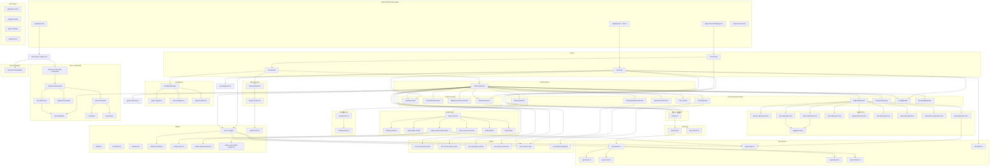

# Smelter Editor — Dependency Graph

```mermaid
flowchart TD
    subgraph Pages["Next.js App Router pages"]
        RL["app/layout.tsx"]
        HP["app/page.tsx - Home"]
        RP["app/room/roomId/page.tsx"]
        RPV["app/room-preview"]
    end

    subgraph APIRoutes["API Routes"]
        ARAR["api/active-rooms"]
        ARGS["api/game-state"]
        ARREC["api/recordings"]
        ARWHIP["api/whip-ack"]
    end

    subgraph ServerActions["Server Actions"]
        ACT["actions.ts"]
    end

    subgraph APILayer["API layer"]
        APIC["api-client.ts"]
        APICTX["api-context.tsx"]
    end

    subgraph Types["Type system"]
        TI["types/index.ts"]
        TINPUT["types/input.ts"]
        TROOM["types/room.ts"]
        TLAYOUT["types/layout.ts"]
        TSHADER["types/shader.ts"]
        GT["game-types.ts"]
        RES["resolution.ts"]
    end

    subgraph Views["Views"]
        IV["IntroView"]
        RV["RoomView"]
        RMP["RoomPage"]
    end

    subgraph Dashboard["Dashboard"]
        DL["DashboardLayout"]
        PR["panel-registry.ts"]
        PW["panel-wrapper.tsx"]
        LT["layout-toolbar.tsx"]
    end

    subgraph ControlPanel["Control Panel"]
        CP["control-panel.tsx"]
    end

    subgraph Contexts["React contexts"]
        ACTX["ActionsContext"]
        CPCTX["ControlPanelContext"]
        WHIPCTX["WhipConnectionsContext"]
        DA["default-actions.ts"]
    end

    subgraph Hooks["Hooks"]
        HCPS["use-control-panel-state"]
        HCPE["use-control-panel-events"]
        HRC["use-recording-controls"]
        HWC["use-whip-connections"]
        HTS["use-timeline-state"]
        HTP["use-timeline-playback"]
    end

    subgraph Sections["Control Panel sections"]
        AVS["AddVideoSection"]
        SS["StreamsSection"]
        QAS["QuickActionsSection"]
        FXA["FxAccordion"]
        TP["TimelinePanel"]
        BCP["BlockClipPropertiesPanel"]
        TS["TransitionSettings"]
        CM["ConfigModals"]
        PWI["PendingWhipInputs"]
    end

    subgraph AddForms["Input forms"]
        GAIF["generic-add-input-form"]
        TAIF["twitch-add-input-form"]
        KAIF["kick-add-input-form"]
        MAIF["mp4-add-input-form"]
        IAIF["image-add-input-form"]
        TXAIF["text-add-input-form"]
        WAIF["whip-add-input-form"]
        SAIF["screenshare-add-input-form"]
        GAMEAIF["game-add-input-form"]
        SB["suggestion-box"]
    end

    subgraph InputEntry["Input Entry"]
        IE["input-entry.tsx"]
        SP["shader-panel.tsx"]
        ASM["add-shader-modal"]
        SESP["snake-event-shader-panel"]
        IETS["input-entry-text-section"]
        DB["delete-button"]
        MB["mute-button"]
    end

    subgraph Sortable["Sortable List"]
        SL["sortable-list.tsx"]
        SItem["sortable-item.tsx"]
    end

    subgraph Video["Video preview"]
        VP["video-preview.tsx"]
        OS["output-stream.tsx"]
    end

    subgraph Voice["Voice commands"]
        STTC["speech-to-text-with-commands"]
        VPC["parseCommand"]
        VDC["dispatchCommand"]
        VUC["useVoiceCommands"]
        VME["macroExecutor"]
        VMS["macroSettings"]
        VN["normalize"]
        VL["levenshtein"]
    end

    subgraph VoiceFB["Voice Feedback"]
        VAF["VoiceActionFeedback"]
    end

    subgraph Utils["Utilities"]
        UTILS["lib/utils.ts"]
        ANIM["animations.ts"]
        KB["keyboard.ts"]
        RC["room-config.ts"]
        TLS["timeline-storage.ts"]
        WEBRTC["webrtc/index.ts"]
        SE["snake-events.ts"]
        SSP["snake-shader-presets.ts"]
        SEEP["snake-event-effect-presets.ts"]
    end

    LS["layout-selector.tsx"]
    CLA["client-layout-addons.tsx"]
    RECL["recordings-list.tsx"]

    HP --> IV
    RP --> RMP
    RMP --> RV
    RL --> CLA
    CLA --> STTC
    CLA --> VAF
    IV --> ACT
    IV --> CM
    IV --> ACTX
    IV --> DA
    IV --> RECL
    IV --> RC
    IV --> RES
    RMP --> ACT
    RV --> VP
    RV --> CP
    RV --> DL
    DL --> PR
    DL --> PW
    DL --> LT
    CP --> ACTX
    CP --> DA
    CP --> CPCTX
    CP --> WHIPCTX
    CP --> HCPS
    CP --> HCPE
    CP --> HWC
    CP --> HRC
    CP --> AVS
    CP --> SS
    CP --> QAS
    CP --> FXA
    CP --> TP
    CP --> BCP
    CP --> TS
    CP --> CM
    CP --> PWI
    CP --> LS
    CP --> RC
    CP --> VMS
    AVS --> GAIF
    AVS --> TAIF
    AVS --> KAIF
    AVS --> MAIF
    AVS --> IAIF
    AVS --> TXAIF
    AVS --> WAIF
    AVS --> SAIF
    AVS --> GAMEAIF
    TAIF --> SB
    KAIF --> SB
    SS --> SL
    SS --> IE
    SL --> SItem
    IE --> SP
    IE --> SESP
    IE --> IETS
    IE --> DB
    IE --> MB
    IE --> ASM
    TP --> HTS
    TP --> HTP
    BCP --> HTS
    STTC --> VUC
    VUC --> VPC
    VUC --> VDC
    VUC --> VME
    VPC --> VN
    VPC --> VL
    VME --> VMS
    VP --> OS
    OS --> WEBRTC
    ACT --> APIC
    APIC --> TI
    DA --> ACT
    TI --> TINPUT
    TI --> TROOM
    TI --> TLAYOUT
    TI --> TSHADER
    GAMEAIF --> GT
    SESP --> GT
    SESP --> SE
    SESP --> SSP
    SESP --> SEEP
    RC --> TI
    RC --> GT
    RC --> TLS
    RC --> HTS
```

---

## Detailed component descriptions

### Next.js App Router pages

#### `app/layout.tsx` — Root Layout

> `editor/app/layout.tsx`

Main Next.js layout. Sets up the Geist fonts (Sans + Mono), global CSS styles, dark background `#161127`. Renders `{children}` (pages) and `<ClientLayoutAddons />` (toast, voice, analytics). Metadata: title "Smelter Editor".

#### `app/page.tsx` — Home page

> `editor/app/page.tsx`

Simple client page (`'use client'`). Entry point at `/`. Renders `<IntroView />`.

#### `app/room/[roomId]/page.tsx` — Room page

> `editor/app/room/[roomId]/page.tsx`

Dynamic Next.js route for a specific room. `roomId` parameter from the URL. Renders `<RoomPage />`.

#### `app/room-preview` — Spectator mode

> `editor/app/room-preview/[roomId]/page.tsx`

Spectate mode — WHEP video preview only, without the control panel.

---

### API Routes (proxy to the server)

#### `api/active-rooms`

> `editor/app/api/active-rooms/`

Next.js API route proxy — returns the list of active rooms from the Smelter server.

#### `api/game-state`

> `editor/app/api/game-state/`

API route proxy — forwards Snake game state to the server.

#### `api/recordings`

> `editor/app/api/recordings/`

API route proxy — downloading MP4 recording files from the server.

#### `api/whip-ack`

> `editor/app/api/whip-ack/`

API route proxy — acknowledging WHIP inputs (heartbeat liveness).

---

### Server Actions & API layer

#### `actions.ts` — Server Actions

> `editor/app/actions/actions.ts`

`'use server'` file — Next.js Server Actions. Creates a `SmelterApiClient` singleton from the `SMELTER_EDITOR_SERVER_URL` env.

Exports ~30 functions:

- `createNewRoom()`, `deleteRoom()`, `updateRoom()`
- `addTwitchInput()`, `addKickInput()`, `addMP4Input()`, `addImageInput()`, `addTextInput()`, `addGameInput()`
- `updateInput()`, `removeInput()`, `disconnectInput()`, `connectInput()`
- `startRecording()`, `stopRecording()`, `getRecordings()`
- `getTwitchSuggestions()`, `getKickSuggestions()`, `getMP4Suggestions()`
- `getAvailableShaders()`, `getRoomInfo()`
- `setPendingWhipInputs()`, `acknowledgeWhipInput()`
- `restartService()` (sudo systemctl)

#### `api-client.ts` — SmelterApiClient

> `editor/lib/api-client.ts`

HTTP client class implementing the `SmelterApiClient` interface. Internal helper `sendSmelterRequest(path, method, body)` — fetch to the server with automatic JSON parsing. ~30 methods mapping 1:1 to the Fastify server endpoints.

#### `api-context.tsx` — SmelterApiProvider

> `editor/lib/api-context.tsx`

React Context providing `SmelterApiClient` on the client side. Exports `SmelterApiProvider` and the `useSmelterApi()` hook. An alternative to server actions when direct client-side calls are needed.

---

### Type system

#### `types/index.ts` — Barrel export

> `editor/lib/types/index.ts`

Re-exports all types from 4 files: `shader.ts`, `layout.ts`, `input.ts`, `room.ts`.

#### `types/input.ts` — Input types

> `editor/lib/types/input.ts`

- `Input` — 7 types: `local-mp4`, `twitch-channel`, `kick-channel`, `whip`, `image`, `text-input`, `game`
- `RegisterInputOptions`, `UpdateInputOptions`, `InputOrientation`

#### `types/room.ts` — Room types

> `editor/lib/types/room.ts`

`RoomState` (inputs, layout, whepUrl, resolution, recording state), `PendingWhipInputData`, `AddInputResponse`, `UpdateRoomOptions`, `RecordingInfo`, `SavedConfigInfo`, `RoomNameEntry`.

#### `types/layout.ts` — Layout types

> `editor/lib/types/layout.ts`

`Layout` type — a union of 9 variants: `grid`, `primary-on-left`, `primary-on-top`, `picture-in-picture`, `wrapped`, `wrapped-static`, `transition`, `picture-on-picture`, `softu-tv`.

#### `types/shader.ts` — Shader types

> `editor/lib/types/shader.ts`

- `ShaderParam` — type: number|color, min/max/default
- `ShaderParamConfig` — paramId + paramValue (number|string)
- `ShaderConfig` — shaderId + params[]
- `AvailableShader` — id, name, description, params, icon SVG

**Note:** `paramValue` is `number | string` in the editor (e.g. hex for colors), `number` on the server.

#### `game-types.ts` — Snake game types

> `editor/lib/game-types.ts`

Canonical source of game types in the editor: `SnakeEventType`, `SnakeEventApplicationMode`, `SnakeEventShaderMapping`, `SnakeEventShaderConfig`. Re-exported by `actions.ts`.

#### `resolution.ts` — Resolution presets

> `editor/lib/resolution.ts`

`Resolution` ({width, height}), `ResolutionPreset` (720p, 1080p, 1440p + vertical), `RESOLUTION_PRESETS` mapping.

---

### Views

#### `IntroView` — Landing page

> `editor/components/pages/intro-view.tsx`

Welcome page (~620 lines):

- Display Name field (localStorage persist)
- Resolution selector (landscape + portrait)
- "Let's go!" button → `createNewRoom()`
- Config import from JSON (local file / remote via `LoadConfigModal`)
- Recordings list (`RecordingsList`)
- Active rooms list (polling 5s) with Join / Guest / Spectate / Delete
- Handles the `smelter:voice:start-room` voice command
- Twitch/Kick channel suggestions when creating a room

#### `RoomPage` — Room wrapper

> `editor/components/room-page/room-page.tsx`

- Reads `roomId` from URL params
- Polls room state every 3s via `getRoomInfo()`
- Saves default inputs to localStorage
- Redirects to `/` if the room does not exist
- Loading spinner → after loading renders `<RoomView>`
- Warning banner if the room is `pendingDelete`

#### `RoomView` — Room view

> `editor/components/pages/room-view.tsx`

**Host mode:**

- `<ControlPanel>` with a `renderDashboard` callback
- `<DashboardLayout>` with panels: video-preview, add-video, buttons, streams, fx, timeline, block-properties
- `<AutoplayModal>` for video playback

**Guest mode:**

- Guest camera preview with a video element
- Rotate 90° button
- Simplified `<ControlPanel>` with `isGuest=true`
- Orientation sync with the server

---

### Dashboard

#### `DashboardLayout` — Panel system

> `editor/components/dashboard/dashboard-layout.tsx`

Responsive dashboard based on `react-grid-layout`. 7 panels: video-preview, add-video, buttons, streams, fx, timeline, block-properties. Drag & drop, resize. Layout persistence in localStorage. Breakpoints: lg(1200), md(900), sm(600), xs(0).

#### `panel-registry.ts` — Panel definitions

> `editor/components/dashboard/panel-registry.ts`

`PANEL_DEFINITIONS` (id, label, icon), `DEFAULT_RESPONSIVE_LAYOUTS`, `loadLayouts()`/`saveLayouts()`, `loadVisiblePanels()`/`saveVisiblePanels()`.

#### `panel-wrapper.tsx`

> `editor/components/dashboard/panel-wrapper.tsx`

Per-panel wrapper — header with title, border, styling.

#### `layout-toolbar.tsx`

> `editor/components/dashboard/layout-toolbar.tsx`

Toolbar with show/hide panel buttons and reset to the default layout.

---

### Control Panel

#### `control-panel.tsx` — Control panel

> `editor/components/control-panel/control-panel.tsx`

Central room management component (~1200 lines). Wraps itself in 3 contexts:

1. `<ActionsProvider>` — actions interface (server actions)
2. `<ControlPanelProvider>` — panel state (inputs, shaders)
3. `<WhipConnectionsProvider>` — WHIP connections

Renders sections: AddVideo, Streams, QuickActions, FX, Timeline, ConfigModals, TransitionSettings, PendingWhipInputs, LayoutSelector.

---

### React contexts

#### `ActionsContext` — Actions interface

> `editor/components/control-panel/contexts/actions-context.tsx`

React Context defining ~30 actions as the `ControlPanelActions` interface: room/input CRUD, recording, channel suggestions, shaders, WHIP management, remote config save/load, `restartService()`.

#### `default-actions.ts` — Default actions

> `editor/components/control-panel/contexts/default-actions.ts`

Implementation of `ControlPanelActions` mapping each method to the corresponding server action from `actions.ts`.

#### `ControlPanelContext` — Panel state

> `editor/components/control-panel/contexts/control-panel-context.tsx`

Provides: `roomId`, `refreshState()`, `inputs: Input[]`, `inputsRef`, `availableShaders: AvailableShader[]`, `isRecording`.

#### `WhipConnectionsContext` — WHIP connections

> `editor/components/control-panel/contexts/whip-connections-context.tsx`

Manages: `cameraPcRef`/`cameraStreamRef`, `screensharePcRef`/`screenshareStreamRef`, `activeCameraInputId`/`activeScreenshareInputId`, `isCameraActive`/`isScreenshareActive`.

---

### Hooks

#### `use-control-panel-state` — Main state

> `editor/components/control-panel/hooks/use-control-panel-state.ts`

`InputWrapper[]` with ordering and flags, synchronization with RoomState (polling), `availableShaders` cache, `updateOrder()`, `changeLayout()`, `isSwapping` animation state.

#### `use-control-panel-events` — Voice events

> `editor/components/control-panel/hooks/use-control-panel-events.ts`

Listens for custom DOM events: `smelter:voice:layout`, `smelter:voice:swap`, `smelter:voice:mute`, `smelter:voice:remove`, `smelter:voice:add-*` and others.

#### `use-recording-controls` — Recording

> `editor/components/control-panel/hooks/use-recording-controls.ts`

`startRecording()` / `stopRecording()`, `isRecording` state, error handling with toast.

#### `use-whip-connections` — WHIP management

> `editor/components/control-panel/hooks/use-whip-connections.ts`

Creating RTCPeerConnection, SDP offer/answer negotiation, heartbeat and cleanup, video rotation (WHIP orientation), auto-reconnect.

#### `use-timeline-state` — Timeline state

> `editor/components/control-panel/hooks/use-timeline-state.ts`

`Track[]` with `Clip[]`, `BlockSettings` per clip (layout, inputs, shaders), adding/removing/moving clips, persist to localStorage.

#### `use-timeline-playback` — Timeline playback

> `editor/components/control-panel/hooks/use-timeline-playback.ts`

Playhead position tracking, auto-advance between blocks, applying BlockSettings to the room via server actions.

---

### Control Panel sections

#### `AddVideoSection`

> `editor/components/control-panel/components/AddVideoSection.tsx`

Buttons and forms for adding inputs: Twitch, Kick, MP4, Image, Text, Camera, Screenshare, Game.

#### `StreamsSection`

> `editor/components/control-panel/components/StreamsSection.tsx`

List of active inputs as a sortable list (`@dnd-kit/core`). Each input as an `<InputEntry>`.

#### `QuickActionsSection`

> `editor/components/control-panel/components/QuickActionsSection.tsx`

Buttons: layout change, recording, config export/import, service restart.

#### `FxAccordion`

> `editor/components/control-panel/components/FxAccordion.tsx`

Accordion with per-input shader panels. Opens `shader-panel.tsx`.

#### `TimelinePanel`

> `editor/components/control-panel/components/TimelinePanel.tsx`

Visual timeline with blocks. Playback controls, playhead, adding blocks.

#### `BlockClipPropertiesPanel`

> `editor/components/control-panel/components/BlockClipPropertiesPanel.tsx`

Edit panel for the selected timeline block: layout, inputs, shaders, duration.

#### `TransitionSettings`

> `editor/components/control-panel/components/TransitionSettings.tsx`

Animation configuration: `swapDurationMs`, `swapFadeInDurationMs`, `swapFadeOutDurationMs`, `swapOutgoingEnabled`.

#### `ConfigModals`

> `editor/components/control-panel/components/ConfigModals.tsx`

`SaveConfigModal` — export to JSON (local/remote). `LoadConfigModal` — import from a file/remote list.

#### `PendingWhipInputs`

> `editor/components/control-panel/components/PendingWhipInputs.tsx`

Pending WHIP connections awaiting acceptance by the host.

---

### Input add forms

| Form                         | File                                            | Input type                        |
| ---------------------------- | ----------------------------------------------- | --------------------------------- |
| `generic-add-input-form`     | `add-input-form/generic-add-input-form.tsx`     | Base wrapper                      |
| `twitch-add-input-form`      | `add-input-form/twitch-add-input-form.tsx`      | `twitch-channel` + suggestion box |
| `kick-add-input-form`        | `add-input-form/kick-add-input-form.tsx`        | `kick-channel` + suggestion box   |
| `mp4-add-input-form`         | `add-input-form/mp4-add-input-form.tsx`         | `local-mp4` + file list           |
| `image-add-input-form`       | `add-input-form/image-add-input-form.tsx`       | `image` + image list              |
| `text-add-input-form`        | `add-input-form/text-add-input-form.tsx`        | `text-input`                      |
| `whip-add-input-form`        | `add-input-form/whip-add-input-form.tsx`        | `whip` (camera)                   |
| `screenshare-add-input-form` | `add-input-form/screenshare-add-input-form.tsx` | `whip` (screenshare)              |
| `game-add-input-form`        | `add-input-form/game-add-input-form.tsx`        | `game` (Snake)                    |
| `suggestion-box`             | `add-input-form/suggestion-box.tsx`             | Channel autocomplete              |

---

### Input Entry

#### `input-entry.tsx` — Input entry

> `editor/components/control-panel/input-entry/input-entry.tsx`

Header with title/icon/status, buttons (mute, delete, hide/show, disconnect/connect), expandable shader panel, text section, Snake shader panel.

#### `shader-panel.tsx` — Shader panel

> `editor/components/control-panel/input-entry/shader-panel.tsx`

List of active shaders with sliders, drag & drop reorder, adding (`AddShaderModal`), removing, number params (slider) and color params (picker).

#### `add-shader-modal` — Add shader modal

> `editor/components/control-panel/input-entry/add-shader-modal.tsx`

List of available shaders with SVG icons. Clicking adds a shader to the input.

#### `snake-event-shader-panel` — Snake shader panel

> `editor/components/control-panel/input-entry/snake-event-shader-panel.tsx`

Per-event effect configuration for the Snake game. Event → shader mapping with presets. Per-player/per-event application mode. Uses: `snake-events.ts`, `snake-shader-presets.ts`, `snake-event-effect-presets.ts`.

#### `input-entry-text-section` — Text editing

> `editor/components/control-panel/input-entry/input-entry-text-section.tsx`

Text input parameters: content, font size, color, alignment, scroll speed, max lines, loop.

---

### Video preview

#### `video-preview.tsx`

> `editor/components/video-preview.tsx`

Preview on/off toggle, input/output mode (guest: camera, host: WHEP output). Uses `<OutputStream>`.

#### `output-stream.tsx` — WHEP Player

> `editor/components/output-stream.tsx`

WebRTC WHEP player (~470 lines): SDP exchange, `MediaStream` reception, controls (play/pause, volume, mute, fullscreen), auto-reconnect. Uses `buildIceServers()` from `lib/webrtc`.

---

### Voice command system

#### `client-layout-addons.tsx`

> `editor/components/client-layout-addons.tsx`

Lazy loads (`ssr: false`): `<SpeechToTextWithCommands />`, `<VoiceActionFeedback />`, `<ToastContainer />`, `<Analytics />`. Hidden on preview pages.

#### `speech-to-text-with-commands` — Voice panel

> `editor/components/speech-to-text-with-commands.tsx`

Advanced voice panel (~600 lines): `react-hook-speech-to-text`, command parsing, dispatch to actions, multi-step macros, slot machine text animation, transcript history, keyboard shortcuts (V toggle), configurable size/opacity.

#### `useVoiceCommands` — Voice hook

> `editor/lib/voice/useVoiceCommands.ts`

Pipeline: `normalize(transcript)` → `parseCommand(text)` → `dispatchCommand(command)` + macro handling.

#### `parseCommand` — Command parser

> `editor/lib/voice/parseCommand.ts`

Recognizes intents (add-twitch, remove, layout, swap, mute, start-room, macro, etc.), fuzzy matching with Levenshtein distance.

#### `dispatchCommand` — Dispatcher

> `editor/lib/voice/dispatchCommand.ts`

Emits custom DOM events (`smelter:voice:*`) on `window`. The Control Panel listens in `use-control-panel-events`.

#### `macroExecutor` — Macro executor

> `editor/lib/voice/macroExecutor.ts`

Sequence of voice commands with delays, progress tracking, abort capability. Definitions in `macros.json`.

#### `macroSettings` — Voice settings

> `editor/lib/voice/macroSettings.ts`

localStorage hooks: `useAutoPlayMacroSetting()`, `useFeedbackPositionSetting()`, `useFeedbackEnabledSetting()`, `useFeedbackSizeSetting()`, `useFeedbackDurationSetting()`, `useDefaultOrientationSetting()`, `useVoicePanelSizeSetting()`, `useVoicePanelOpacitySetting()`.

#### `normalize` / `levenshtein`

> `editor/lib/voice/normalize.ts` · `editor/lib/voice/levenshtein.ts`

Text normalization (lowercase, punctuation, Polish characters, OCR correction). Levenshtein distance for fuzzy matching of commands.

#### `VoiceActionFeedback`

> `editor/components/voice-action-feedback/VoiceActionFeedback.tsx`

Overlay with visual confirmation of a recognized voice command

---

### Utilities

| Module                          | File                                       | Description                                                                         |
| ------------------------------- | ------------------------------------------ | ----------------------------------------------------------------------------------- |
| `utils.ts`                      | `editor/lib/utils.ts`                      | `cn()` — `clsx` + `tailwind-merge`                                                  |
| `animations.ts`                 | `editor/utils/animations.ts`               | Framer Motion variants: `staggerContainer`, `fadeIn`, `fadeInUp`                    |
| `keyboard.ts`                   | `editor/lib/keyboard.ts`                   | `shouldIgnoreGlobalShortcut()`                                                      |
| `room-config.ts`                | `editor/lib/room-config.ts`                | `exportRoomConfig()`, `downloadRoomConfig()`, `parseRoomConfig()`, timeline persist |
| `timeline-storage.ts`           | `editor/lib/timeline-storage.ts`           | `loadTimeline(roomId)` / `saveTimeline(roomId, data)` — localStorage                |
| `webrtc/index.ts`               | `editor/lib/webrtc/index.ts`               | `buildIceServers()`, `waitIceComplete()`                                            |
| `snake-events.ts`               | `editor/lib/snake-events.ts`               | Labels and descriptions for `SnakeEventType`                                        |
| `snake-shader-presets.ts`       | `editor/lib/snake-shader-presets.ts`       | Per-player shader presets for Snake                                                 |
| `snake-event-effect-presets.ts` | `editor/lib/snake-event-effect-presets.ts` | Effect presets per event type                                                       |

---

### Other components

| Component             | File                                                              | Description                              |
| --------------------- | ----------------------------------------------------------------- | ---------------------------------------- |
| `layout-selector.tsx` | `editor/components/layout-selector.tsx`                           | Layout selector (9 variants with icons)  |
| `recordings-list.tsx` | `editor/components/recordings-list.tsx`                           | Dialog with a list of MP4 recordings to download |
| `sortable-list.tsx`   | `editor/components/control-panel/sortable-list/sortable-list.tsx` | `@dnd-kit/core` drag & drop wrapper      |
| `sortable-item.tsx`   | `editor/components/control-panel/sortable-list/sortable-item.tsx` | Per-item `@dnd-kit/sortable` wrapper     |
| `warning-banner.tsx`  | `editor/components/warning-banner.tsx`                            | Warning banner (pending delete)          |
| `ArrowHint.tsx`       | `editor/components/room-page/ArrowHint.tsx`                       | Visual arrow hint                        |
