# Smelter Editor Companion ~~Cube~~ App

## Important disclaimers

### Untested on iOS. Use at your own peril

### Unimplemented features

- Timeline Screen (placeholder only, not yet functional)
- Help Screen (not yet created)

## Description

A companion app for [Smelter Editor](https://github.com/smelter-labs/smelter-editor), designed to run on a tablet alongside the editor web client. Connects to a Smelter instance via WebSocket and lets you view and manage inputs and layouts from a touch-first interface.

## Setup

After cloning the repo, run

- `npx expo install`
- `npx expo prebuild`
- `npx expo run:android --port 2137` (port can be whatever you want, but it defaults to 8081, same as the web app, which is less than ideal). Alternatively, download the latest release from repository.

Make sure you got a smelter editor instance running, both the server and the editor. Create a room.
If the instance is not on localhost, you can join a room via a QR code. Otherwise you need to fill in the url by hand. Include protocol (ws or wss), ip and port of the node.js server (3001 by default). Press the join button next to the input field - if the server is available, it will get saved for the future. You can then pick the room you want by its name. Alternatively, if the room is private, you can press "Join a private room instead".

Then, press the "join as editor" button. The app will try to connect to `ws(s)://<IP_WITH_PORT>/room/<ROOM_ID>/ws`. It will display an activity indicator while it does so - might take a while.
After that, it should be visible as "Mobile App" in the peers section of the Smelter Editor.

Alternatively, if you want to connect as source of video, press "Join as Camera"

## UI structure and usage

```mermaid
flowchart LR
    JoinRoom["<b>Join Room</b><br/>(Server URL, Room ID)"]
    Camera["<b>Camera Screen</b><br/>(WHIP streaming)"]
    Help["Help Screen"]

    subgraph App ["App Session (3-finger swipe horizontally)"]
        direction LR
        Layout["Layout Screen"]
        Inputs["Inputs Screen"]
        Timeline["Timeline Screen ⚠️"]
        Debug["Debug Screen"]

        Layout <-->|"3-finger swipe"| Inputs
        Inputs <-->|"3-finger swipe"| Timeline
        Timeline <-->|"3-finger swipe"| Debug
    end

    JoinRoom ==>|"Join as Editor"| Layout
    JoinRoom ==>|"Join as Camera"| Camera
    JoinRoom -->|"? button"| Help
    Camera -.->|"back / disconnect"| JoinRoom
    Help -.->|"back"| JoinRoom
    App -.->|"WS disconnect (any screen)"| JoinRoom

    style Layout fill:#1E293B,stroke:#38BDF8,stroke-width:3px
    style Inputs fill:#063E3B,stroke:#10B981,stroke-width:3px
    style Timeline fill:#1E1B4B,stroke:#818CF8,stroke-width:3px
    style Debug fill:#171717,stroke:#6B7280,stroke-width:3px
    style Camera fill:#1E1040,stroke:#A78BFA,stroke-width:3px
    style Help fill:#171717,stroke:#6B7280,stroke-width:2px
    style App fill:none,stroke:#9ca3af,stroke-dasharray: 5 5
```

```mermaid
%%{init: {'flowchart': {'curve': 'basis'}} }%%
flowchart LR
    Main["<b>Layout Screen</b><br/>(Grid Canvas)"]

    subgraph Overlays ["Overlays"]
        Layers["Layers Panel<br/>(Visibility / Add / Delete)"]
        Settings["Settings Panel<br/>(Grid Config / Resolution)"]
        Effects["Effects Panel<br/>(Per-input effects)"]
    end

    Main -->|"tap LAYERS chip"| Layers
    Layers -->|"tap backdrop"| Main

    Main -->|"2-finger edge swipe<br/>or cog icon"| Settings
    Settings -->|"tap backdrop"| Main

    Main -->|"long-press grid item"| Effects
    Effects -->|"tap backdrop"| Main

    style Main fill:#1E293B,stroke:#38BDF8,stroke-width:3px
    style Layers fill:#334155,stroke:#38BDF8,stroke-width:3px
    style Settings fill:#334155,stroke:#38BDF8,stroke-width:3px
    style Effects fill:#334155,stroke:#38BDF8,stroke-width:3px
    style Overlays fill:#1E293B,stroke:#3b82f6,stroke-dasharray: 3 3
```

```mermaid
%%{init: {'flowchart': {'curve': 'basis'}} }%%
flowchart LR
    Main["<b>Inputs Screen</b><br/>(Source Cards — draggable)"]

    subgraph Overlays ["Overlays"]
        Panel["Input Detail Panel<br/>(Input ID / metadata)"]
        Settings["Input Settings Panel<br/>(Grid cols / Sort mode)"]
    end

    Main -->|"tap card"| Panel
    Panel -->|"tap backdrop"| Main

    Main -->|"2-finger edge swipe"| Settings
    Settings -->|"tap backdrop"| Main

    style Main fill:#063E3B,stroke:#10B981,stroke-width:3px
    style Panel fill:#065F46,stroke:#10B981,stroke-width:3px
    style Settings fill:#065F46,stroke:#10B981,stroke-width:3px
    style Overlays fill:#063E3B,stroke:#3b82f6,stroke-dasharray: 3 3
```

```mermaid
%%{init: {'flowchart': {'curve': 'basis'}} }%%
flowchart LR
    Main["<b>Camera Screen</b><br/>(WHIP Streaming)"]

    subgraph States ["Connection States"]
        direction LR
        Idle["Idle"]
        Preview["Preview<br/>(live camera feed)"]
        Connecting["Connecting<br/>(WebRTC handshake)"]
        Streaming["Streaming"]
        Error["Error"]
    end

    subgraph Overlays ["Overlays"]
        Log["Connection Log Modal<br/>(ICE / WebRTC debug)"]
    end

    Main --> Idle
    Idle -->|"grant permissions"| Preview
    Preview -->|"Start Stream"| Connecting
    Connecting -->|"WebRTC connected"| Streaming
    Connecting -->|"failure"| Error
    Streaming -->|"Stop"| Preview
    Error -->|"retry"| Connecting

    Main -->|"log icon"| Log
    Log -->|"close"| Main

    style Main fill:#1E1040,stroke:#A78BFA,stroke-width:3px
    style Idle fill:#1E1040,stroke:#A78BFA,stroke-width:2px
    style Preview fill:#1E1040,stroke:#A78BFA,stroke-width:2px
    style Connecting fill:#1E1040,stroke:#FBBF24,stroke-width:2px
    style Streaming fill:#1E1040,stroke:#34D399,stroke-width:2px
    style Error fill:#1E1040,stroke:#F87171,stroke-width:2px
    style Log fill:#2D1B69,stroke:#A78BFA,stroke-width:2px
    style States fill:none,stroke:#A78BFA,stroke-dasharray: 3 3
    style Overlays fill:none,stroke:#A78BFA,stroke-dasharray: 3 3
```

