# Smelter Editor Companion ~~Cube~~ App

## Important disclaimers

### Untested on iOS. Use at your own peril

### Unimplemented features

- Rearranging inputs (the UI components in the Inputs screen are not yet draggable)

## Description

A companion app for [Smelter Editor](https://github.com/smelter-labs/smelter-editor), designed to run on a tablet alongside the editor web client. Connects to a Smelter instance via WebSocket and lets you view and manage inputs and layouts from a touch-first interface.

## Setup

After cloning the repo, run

- `npx expo install`
- `npx expo prebuild`
- `npx expo run:android --port 2137` (port can be whatever you want, but it defaults to 8081, same as the web app, which is less than ideal). Alternatively, download the latest release from repository.

Make sure you got a smelter editor instance running, both the server and the editor. As the changes are not merged to main, the current revision is on the [@Frendzlu/websockets branch](https://github.com/smelter-labs/smelter-editor/tree/%40Frendzlu/websockets). Create a room.

Normally, you would then press a "Join via QR" button on the editor web client, but that feature is WIP.
For now just get the local ip address of the server instance, and input it in the server URL, including the port. Do not include the protocol.

The app will then try to retrieve available rooms from `/rooms` API endpoint. This is marked by an activity indicator next to "Room ID" label (very small). In case you want to update the list, force an update on the `Server URL` input.

If any rooms are available, a select will appear. You can then pick the room you want by its name (not ID!). The `Room ID` input should automatically populate with the correspondind ID. Alternatively, type the room id by name.

Then, press the connect button. The app will try to connect to `ws://<IP_WITH_PORT>/room/<ROOM_ID>/ws`. It will display an activity indicator while it does so - might take a while.

After that, it should be visible as "Mobile App" in the peers section of the Smelter Editor.

## UI structure and usage

```mermaid
flowchart LR
    JoinRoom["<b>Join Room</b><br/>(Server URL, Room ID)"]

    subgraph App ["App Session <br>(Swipe horizontally)"]
        direction TB
        Layout["Layout Screen"]
        Inputs["Inputs Screen"]
        Timeline["Timeline Screen"]
        Debug["Debug Screen"]

        Layout <-->|"3-finger swipe"| Inputs
        Inputs <-->|"3-finger swipe"| Timeline
        Timeline <-->|"3-finger swipe"| Debug
    end

    %% Connection Logic
    JoinRoom ==>|"press Connect"| Layout
    App -.->|"WS disconnect (any screen)"| JoinRoom

    %% Styling
    style Layout fill:#1E293B,stroke:#38BDF8,stroke-width:3px
    style Inputs fill:#063E3B,stroke:#10B981,stroke-width:3px
    style Timeline fill:#1E1B4B,stroke:#818CF8,stroke-width:3px
    style Debug fill:#171717,stroke:#6B7280,stroke-width:3px
    style App fill:none,stroke:#9ca3af,stroke-dasharray: 5 5
```

```mermaid
%%{init: {'flowchart': {'curve': 'basis'}} }%%
flowchart LR
    Main["<b>Layout Screen</b><br/>(Grid View)"]

    subgraph Modals ["Overlays"]
        Panel["Side Panel<br/>(Stream Info)"]
        Settings["Settings Panel<br/>(Grid Config)"]
    end

    Main -->|"tap grid item"| Panel
    Panel -->|"tap backdrop"| Main

    Main -->|"2-finger edge swipe"| Settings
    Settings -->|"tap backdrop"| Main

    style Main fill:#1E293B,stroke:#38BDF8,stroke-width:3px
    style Panel fill:#334155,stroke:#38BDF8,stroke-width:3px
    style Settings fill:#334155,stroke:#38BDF8,stroke-width:3px
    style Modals fill:#1E293B,stroke:#3b82f6,stroke-dasharray: 3 3
```

```mermaid
%%{init: {'flowchart': {'curve': 'basis'}} }%%
flowchart LR
    Main["<b>Inputs Screen</b><br/>(Source Cards)"]

    subgraph Modals ["Overlays"]
        Panel["Input Detail<br/>(Volume/Mute)"]
        Settings["Source Settings<br/>(Resolution/Crop)"]
    end

    Main -->|"tap card"| Panel
    Panel -->|"tap backdrop"| Main

    Main -->|"2-finger edge swipe"| Settings
    Settings -->|"tap backdrop"| Main

    style Main fill:#063E3B,stroke:#10B981,stroke-width:3px
    style Panel fill:#065F46,stroke:#10B981,stroke-width:3px
    style Settings fill:#065F46,stroke:#10B981,stroke-width:3px
    style Modals fill:#063E3B,stroke:#3b82f6,stroke-dasharray: 3 3
```

