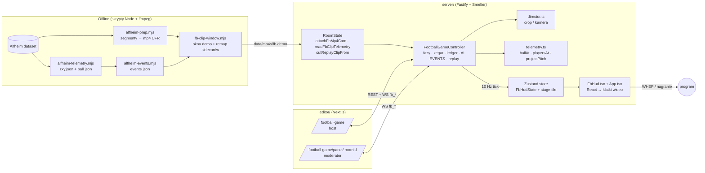

# Football game — „Touchline"

Realizacja transmisji meczu piłkarskiego z plików wideo (dataset **Alfheim**
z Simula): jedna zszyta panorama stadionu 4450×2000 albo trzy stałe kamery.
Na tym materiale serwer robi „telewizję":

- **wirtualny reżyser** wycina z panoramy okno 16:9 i płynnie podąża za piłką
  (albo tnie między trzema kamerami),
- **AI EVENTS** — zagrania (CHANCE / SHOT / CORNER / GOAL? / SPRINT / ATTACK)
  pojawiają się na antenie jako bannery, trafiają do protokołu (ledger) i
  dostają **instant replay**,
- **minimapa trackingu** pokazuje pozycje zawodników gospodarzy i piłkę,
- **panel moderatora** (telefon / tablet / laptop) zatwierdza gole (REF CALL),
  prowadzi zegar i połowy, wybiera ujęcie.

To bliźniak koszykówki („Blacktop", `server/src/basketball/`) — ten sam kit UI
i te same szwy w `RoomState`, ale **bez kamer z telefonów i bez workera
Pythona**. Wyjście to zwykły program Smeltera danego pokoju (WHEP), nagrywany
standardowym `record/start` / `record/stop`.

---

## Spis treści

1. [Demo w 5 minut](#demo-w-5-minut)
2. [Gdzie tu jest AI](#gdzie-tu-jest-ai)
3. [Jak to działa — przepływ](#jak-to-działa--przepływ)
4. [Mapa plików](#mapa-plików)
5. [Strony i role](#strony-i-role)
6. [Dane: dataset, sidecary, przygotowanie klipów](#dane-dataset-sidecary-przygotowanie-klipów)
7. [Wirtualny reżyser](#wirtualny-reżyser)
8. [Mecz, protokół, REF CALL, replay](#mecz-protokół-ref-call-replay)
9. [HUD na antenie](#hud-na-antenie)
10. [API: REST + WebSocket](#api-rest--websocket)
11. [Konfiguracja (`FbConfig`)](#konfiguracja-fbconfig)
12. [Testy i weryfikacja](#testy-i-weryfikacja)
13. [Pułapki i znane ograniczenia](#pułapki-i-znane-ograniczenia)
14. [Historia zmian](#historia-zmian)

---

## Demo w 5 minut

### 0. Czego potrzebujesz

- Klipy demo w `server/data/mp4s/fb-demo/` (katalog `server/data/` jest
  gitignorowany — na świeżym klonie trzeba je przygotować, patrz
  [Dane](#dane-dataset-sidecary-przygotowanie-klipów)):

  | Klip | Przycisk QUICK DEMOS | Rozdzielczość | Długość | Co się w nim dzieje |
  |---|---|---|---|---|
  | `fb-demo/pano-3x40s/pano.mp4` | **1** · TROMSØ – TOTTENHAM | 4450×2000 @ 25 | 120 s (pętla) | **najlepszy do demo**: 6 strzałów, 3 szanse, 2 rożne, 7 sprintów; pierwszy SHOT już w 4,6 s |
  | `fb-demo/pano-shot-2815/pano.mp4` | — | 4450×2000 @ 25 | 60 s | jedna akcja: celny strzał Tromsø w 19,6 s, szansa 21,0 s, rożny 52,9 s |
  | `fb-demo/pano-anzhi-goal/pano.mp4` | **2** · TROMSØ – ANZHI | 4450×2000 @ 25 | 118 s | **jedyny prawdziwy gol**: Tromsø–Anzhi 0:1, 90+3' — szansa 62,7 s, celny strzał 65,2 s, **GOAL? (REF CALL) 66,0 s** w prawej bramce, potem cieszynka i wznowienie od środka. Przycisk 2 ustawia drużynę B na `ANZHI` / `ANZ` (ręcznie: w setupie); moderator potwierdza gola klawiszem **B** |
  | `fb-demo/pano-half-3min/pano-half.mp4` | — | 2224×1000 @ 25 | 180 s | panorama w połowie rozdzielczości — **gdy silnik gubi klatki** na 4450×2000 |
  | `fb-demo/tricam-3min/cam{0,1,2}.mp4` | **3** · TROMSØ – STRØMSGODSET | 1280×960 @ 30 | 180 s | trzy kamery; brak toru piłki → tylko sprinty + reguła cięć |

- Zbudowane typy: `pnpm --filter @smelter-editor/types build`.
- `ffmpeg` w `PATH` (wycina klipy do instant replay).

### 1. Uruchom stack

```bash
# terminal 1 — serwer (natywnie; Docker na macOS nie ma GPU i jest dużo wolniejszy)
cd server
FB_SIM=1 SKIP_PYTHON=1 pnpm start
# na tym laptopie (macOS) z poprawionym silnikiem:
# FB_SIM=1 SKIP_PYTHON=1 SMELTER_PATH=~/.smelter/v0.6.0-scfix/main_process pnpm start

# terminal 2 — edytor
cd editor
pnpm dev            # SMELTER_EDITOR_SERVER_URL w editor/.env.local → http://localhost:3001
```

- `FB_SIM=1` odblokowuje `POST …/simulate-event` (przyda się do pokazania REF CALL).
- `SKIP_PYTHON=1` nie startuje sidecarów Pythona (napisy, modele AI) — football
  ich nie potrzebuje, a serwer wstaje szybciej.
- Gdy `:3001` / `:8000` zajmuje inna sesja, stack równoległy:
  `SMELTER_DEMO_API_PORT=3111 SMELTER_API_PORT=8100 CAPTIONS_WS_PORT=8182 … pnpm start`
  (+ edytor z `SMELTER_EDITOR_SERVER_URL` i `NEXT_PUBLIC_SMELTER_SERVER_URL` na `:3111`).
- Dłuższe pokazy odpalaj pod `caffeinate -i` — uśpiony laptop rozciąga zegar
  ścienny (zegar meczu skacze, wejścia plikowe robią się czarne).

### 2. Scenariusz (host = laptop, moderator = telefon)

**Najszybciej:** na ekranie tytułowym `/football-game` są trzy przyciski
**QUICK DEMOS** (klawisze **1** / **2** / **3**): Tromsø–Tottenham
(panorama, najwięcej akcji), Tromsø–Anzhi (prawdziwy gol, 2. połowa) i
Tromsø–Strømsgodset (trzy kamery). Jeden przycisk tworzy pokój, ustawia nazwy,
skróty i kolory drużyn (`editor/components/football-game/demo-presets.ts`),
sam podpina klipy z `fb-demo/` (i restartuje je razem przy trzech kamerach)
i ląduje w **PRE-MATCH** — zostaje QR moderatora i **KICK-OFF** (kroki 4–10
poniżej). Reszta ustawień hosta (rozdzielczość, perf, reżyser) zostaje jak
w SETUP. Gdy klipu brakuje w `data/mp4s`, przycisk jest wyszarzony z nazwą
brakującego pliku. Ścieżka ręczna:

1. **Host:** otwórz `http://localhost:3000/football-game` (albo przycisk
   **Football** w sekcji *Games* na stronie startowej) → **OPEN THE MATCH**.
2. **MATCH SETUP:** zostaw domyślne (TROMSØ – TOTTENHAM, 45 min, zegar
   *FROM THE CLIP*, AI EVENTS on, MINIMAP on, replay po SHOT i GOAL) →
   **OPEN THE MATCH**.
3. **PRE-MATCH:** wybierz **STADIUM PANORAMA**, w pickerze klip
   `fb-demo/pano-3x40s/pano.mp4` → **USE FILE**. Poczekaj, aż wiersz kamery
   pokaże `BALL · PLAYERS · EVENTS`, a chip AI — **AI EVENTS · ARMED**.
   - `BALL` = jest `ball.json` → działa kamera FOLLOW,
   - `PLAYERS` = jest `zxy.json` → działa minimapa,
   - `EVENTS` = jest `events.json` → działają AI EVENTS.
4. **Moderator:** zeskanuj QR panelu (telefon w tej samej sieci Wi‑Fi) albo
   otwórz `/football-game/panel/<roomId>` na drugim ekranie → podaj imię.
5. **KICK-OFF** (host albo panel). Na antenie: score bug z minutą meczu, okno
   podąża za piłką. W ~4,6 s pada pierwszy **SHOT** → banner → po 1,5 s okno
   **REPLAY** z tym samym kadrem, co leciał na żywo.
6. **Pokaż reżysera:** w panelu plakietka VIEW (albo rząd VIEW / REPLAY /
   MINIMAP na ekranie live hosta — działa bez moderatora) → `WIDE`, `LEFT GOAL`,
   `RIGHT GOAL`, z powrotem `AUTO` (przejścia to 600 ms glide albo twarde
   cięcie — `VIEW SWITCH` w setupie). W **FOLLOW TUNING** przełącz presety
   SNAPPY / SMOOTH / CINEMATIC — zmiana „czucia" kamery jest widoczna na żywo.
7. **Pokaż minimapę:** MINIMAP · ON/OFF, rozmiar 1–5. (Minimapa chowa się na
   czas okna REPLAY, ok. 6 s po każdym strzale.)
8. **Pokaż REF CALL** — w materiale nie ma żadnego gola, więc kandydata trzeba
   wstrzyknąć:

   ```bash
   curl -X POST localhost:3001/room/<roomId>/football-game/simulate-event \
     -H 'content-type: application/json' -d '{"kind":"goal","side":"left"}'
   ```

   Na antenie pojawia się **GOAL?** + pigułka REF CALL, w panelu karta REF
   CALLS. Moderator: klawisz **A** / **B** (gol dla drużyny) albo **N** / **V**
   (nie ma gola). Po zatwierdzeniu: banner **GOAL!**, wynik w score bugu.
   Alternatywa bez `curl`: przyciski **GOAL TIL** / **GOAL TOT** w panelu
   (gol ręczny, od razu potwierdzony) i **UNDO LAST**.
9. **Zegar i połowy:** `SPACE` pauza/wznowienie, `H` HALF TIME → SECOND HALF,
   `E` (dwa razy) FULL TIME, `U` undo. RESET i FULL TIME pytają dwukrotnie.
10. **FULL TIME** → banner końcowy, a 3,5 s później plansza końcowa na antenie i
    ekran wyników ze statystykami (CHANCES / SHOTS / ON TARGET / CORNERS /
    SPRINTS) → **NEW MATCH** albo **EXIT TO TITLE**.

**Wariant „trzy kamery":** w PRE-MATCH wybierz **THREE CAMERAS**, przypnij
`cam0` → LEFT, `cam1` → CENTRE, `cam2` → RIGHT, potem **RESTART CLIPS 0:00**
(wspólny start). Picker pokazuje tylko klipy z właściwego riga, a serwer
odmówi panoramy jako kamery (i odwrotnie) — HTTP 400 z powodem. Reżyser
otwiera kamerą środkową i ok. 16 s później tnie na lewą, gdy oznaczeni
zawodnicy schodzą pod lewą bramkę; ręczny wybór kamery z panelu działa
natychmiast, `AUTO` wraca z dwellem 4 s.

### Co powiedzieć o demo w jednym zdaniu

„Z jednego nieruchomego ujęcia całego stadionu robimy w czasie rzeczywistym
realizację telewizyjną: kamera sama chodzi za piłką, zdarzenia same wskakują
na antenę z powtórką, a człowiek zatwierdza tylko to, co sporne — gola."

---

## Gdzie tu jest AI

Uczciwie: **w runtime nie działa żaden model.** Nie ma workera Pythona,
side-channela ani inferencji. „AI" w Touchline to trzy rzeczy:

### 1. AI EVENTS = adnotacje z datasetu odtwarzane na zegarze pliku

To wzorzec „Ultra AI" znany z koszykówki: zdarzenia są **policzone offline**
i zapisane w sidecarze `events.json`, a serwer **odpala je dokładnie w
momencie, w którym dana klatka idzie na antenę** — dla widza wygląda to jak
wywołanie modelu.

- **Skąd się biorą:** `server/scripts/alfheim-events.mjs` — deterministyczne
  reguły geometryczne na danych z datasetu: tor piłki (`ball.json`, piksel na
  klatkę → metry boiska przez model kamery) i pozycje zawodników z czujników
  **ZXY** (`zxy.json`, 20 Hz, tylko Tromsø). Np. `shot` = ≥ 4 próbki z
  prędkością 9–35 m/s w stożku 25° do środka bramki, start ≤ 35 m od linii,
  piłka w ciągu 2 s dochodzi na ≤ 6 m od linii bramkowej (`onTarget`, gdy
  trafia w światło bramki); `sprint` = ZXY ≥ 7 m/s przez ≥ 1 s. Pełna lista
  reguł jest w nagłówku skryptu.
- **Jak są odpalane:** `FootballGameController.armAiEvents()` wczytuje sidecar
  (`RoomState` szuka najpierw `<clip>.events.json`, potem `events.json` w
  katalogu klipu), `selectAiEvents()` filtruje po `config.ai.kinds` i
  przelicza drużynę ze strony boiska, `scheduleAi()` / `fireAi()` planują
  `setTimeout` na czas `anchor + (tMs − playFrom)` zegara wejścia plikowego.
  Pętla klipu → zdarzenia lecą od nowa (`loopIndex`); spóźnione o > 2 s są
  pomijane; poza fazą `live`/`paused` liczą się jako `skipped`.
- **„Pewność modelu":** `aiConfidence()` w `groundTruth.ts` — **deterministyczna
  funkcja** rodzaju i czasu zagrania (0,86–0,97; sprint/attack 0,99; gol
  zawsze 0,5). To kosmetyka pod UI, nie wynik modelu.
- **Kamuflaż:** wpis w protokole ma `source: 'ai'`, a log w panelu
  (**AI LOG**, `aiLog.ts` → WS `fb_ai_log`) pisze np.
  `SHOT · TOT · 91 % · off target · 27 m/s`.
- **Status chipa:** `off` → `no_clip` → `loading` → `armed` (albo `no_events`,
  gdy klip nie ma sidecara — wtedy zostaje tylko ręczny protokół).

### 2. Człowiek w pętli (REF CALL)

Zdarzenie potwierdza się samo tylko, gdy ma drużynę i pewność ≥ 0,6
(`AUTO_CONFIRM_MIN_CONF`). **Gol zawsze ląduje jako `pending`** (kandydat) i
czeka na moderatora; tak samo każde zagranie bez drużyny (`team: null`).
Wynik meczu liczy się wyłącznie z **potwierdzonych** goli w protokole.

### 3. Wirtualny reżyser = algorytm, nie model

`director.ts` to czysta matematyka (sprężyna krytycznie tłumiona, martwa
strefa, limit prędkości, auto-zoom) sterowana **znanym torem piłki** — reżyser
„patrzy w przyszłość" (`lookaheadMs` 500 ms), bo przyszłość piłki jest w pliku.

### Gdzie wszedłby prawdziwy model

- Planowany (poza v1) worker **„football-director"** (port 8093): detekcja
  osób → centroid akcji na panoramie → cel dla okna FOLLOW zamiast `ball.json`.
- Szew czasowy już istnieje: `FbClipClock.delayMs` = opóźnienie side-channela
  (klatka idzie na antenę `delayMs` po tym, jak „widzi" ją AI). HUD jest
  wstrzymywany o tę samą wartość, więc banner ląduje na właściwej klatce. Dziś
  `delayMs = 0` (brak modelu → ręczne gole i zmiany ujęć są natychmiastowe).
- Żeby podmienić źródło zdarzeń, wystarczy wołać `ingestEvent({ source: 'ai', … })`
  z realnego workera zamiast z `fireAiEvent()` — reszta (protokół, bannery,
  replay, REF CALL) jest niezależna od źródła.

---

## Jak to działa — przepływ



Pętla kontrolera chodzi co 100 ms (`TICK_MS`): krok reżysera → nowy kafel
sceny, sprawdzenie zegara AI i pętli klipu, publikacja HUD (`hudPublishHz`,
domyślnie 5 Hz), `fb_match` i `fb_director` co 1 s.

**Wirtualna kamera to trik layoutu:** panorama jest renderowana jako
**przeskalowany, za duży kafel z ujemnym offsetem** (`tileForCrop`), a silnik
przycina go do wyjścia 16:9. Każdy krok (10 Hz) zleca liniowy glide 250 ms,
który następny krok przerywa — kamera nigdy nie „dojeżdża i czeka".

---

## Mapa plików

### Serwer

| Plik | Rola |
|---|---|
| [FootballGameController.ts](FootballGameController.ts) | serce: fazy meczu, zegar, kamery plikowe, AI EVENTS, protokół, REF CALL, instant replay, scena/stage, HUD snapshot, obsługa WS `fb_*` |
| [director.ts](director.ts) | wirtualny reżyser: `stepFollow` (sprężyna), `wideCrop` / `goalCrop`, `tileForCrop`, reguła cięć trzech kamer |
| [telemetry.ts](telemetry.ts) | parsowanie sidecarów do typed arrays, model kamery (`projectPitch` / `unprojectPitch`), `ballAt` / `ballMean` / `playersAt` / `centroidAt` / `statsAt` / `sprintAt` |
| [groundTruth.ts](groundTruth.ts) | parser `events.json`, `selectAiEvents()`, `aiConfidence()` |
| [aiLog.ts](aiLog.ts) | log „co odpaliło i dlaczego" (cap 60), słownictwo bannerów |
| [clipSession.ts](clipSession.ts) | rig klipu z `<clip>.alfheim.json` → odmowa panoramy jako kamery i odwrotnie |
| [mp4CamFileName.ts](mp4CamFileName.ts) | sanityzacja ścieżki klipu dla `mp4-cam` |
| [`__tests__/`](__tests__/) | director, telemetry, ground truth, metryki HUD, harness kontrolera |
| [../inputs/FbHud.tsx](../inputs/FbHud.tsx) (+ `fbHudMetrics.ts`) | grafika na antenie |
| [../room/RoomState.ts](../room/RoomState.ts) | `attachFbMp4Cam`, `syncFbFileCams`, `readFbClipTelemetry`, lookup `events.json`, `cutReplayClipFrom`, sprzątanie `fb-replays` |
| [../routing/routes.ts](../routing/routes.ts) | REST `…/football-game/*`, prefiks WS `fb_`, `activeGameOf` |
| `../app/store.ts`, `../app/App.tsx`, `../smelter.tsx` | `FbHudState` / `setFbGame`, `FbHudSlot`, rejestracja obrazków `imgs/fb` |

### Typy

[packages/types/src/football-game-events.ts](../../../packages/types/src/football-game-events.ts)
— wszystkie typy `Fb*`, `FB_DEFAULT_CONFIG`, `FB_DIRECTOR_LIMITS`, komunikaty
WS w obie strony. Po zmianie: `pnpm --filter @smelter-editor/types build`.

### Edytor

| Ścieżka | Rola |
|---|---|
| `editor/app/football-game/**` | trasy: host, host z `roomId`, panel |
| `editor/components/football-game/arcade.tsx` | maszyna ekranów hosta |
| `…/screens/{title,setup,lobby,live,results}-screen.tsx` | ekrany hosta |
| `…/demo-presets.ts` | QUICK DEMOS: trzy presety (drużyny + klipy per rola) z ekranu tytułowego |
| `…/screens/host-director-row.tsx` | rząd VIEW / REPLAY / MINIMAP + KICK moderatora na ekranie live |
| `…/panel/{moderator-panel,panel-screen,use-fb-panel-socket}.tsx` | panel moderatora (kreator connect → name → panel) |
| `…/use-fb-room.ts`, `use-fb-feed.ts` | REST pokoju / feed WS |
| `…/file-cam-picker.tsx` | wybór klipów z `data/mp4s`, USE FILE / RESTART CLIPS 0:00 |
| `…/follow-tuning.tsx` | strojenie kamery FOLLOW (wspólne dla setupu i panelu) |
| `…/view-labels.ts`, `clip-role.ts`, `live-config-diff.ts` | etykiety widoków, rola klipu z nazwy pliku (cam0/1/2), wysyłka tylko zmienionych sekcji konfiguracji |
| `…/fb-kit.tsx`, `fb-kit.css` | kit UI (klon `bb-kit`) |

### Skrypty (`server/scripts/`)

`alfheim-fetch.mjs` (pobieranie datasetu) · `alfheim-prep.mjs` (segmenty → mp4)
· `alfheim-telemetry.mjs` (`zxy.json`, `ball.json`) · `alfheim-events.mjs`
(`events.json`) · `fb-clip-window.mjs` (okna/montaże demo z remapem sidecarów)
· `fb-ball-keyframes.mjs` + `.html` (ręczny tor piłki → `ball.json`) · `fb-fit-camera.py` (dopasowanie modelu kamery)
· `fb-away-detect.py` + `fb_away_lib.py` (goście z wideo → `away.json`; testy `test_fb_away_lib.py`)
· `fb-render-assets.mjs` (plansze PNG HUD → `imgs/fb/`) · `fb-zones/*.json`
(model kamery + orientacja ZXY) · `football-e2e.mjs`, `football-live-check.mjs`
· `lib/alfheim.mjs`, `lib/fb-api.mjs`.

---

## Strony i role

| URL | Kto | Co |
|---|---|---|
| `/football-game` | host (laptop) | title → setup → pre-match → live → full time |
| `/football-game/<roomId>` | host | to samo, odtworzone po odświeżeniu |
| `/football-game/panel/<roomId>?server=…` | moderator | REF CALLS, zegar i połowy, zdarzenia ręczne, VIEW, FOLLOW TUNING, monitor programu, kamery, LEDGER, AI LOG, tabela trackingu |

Miejsce moderatora jest jedno na pokój (`fb_commentator_join`, klucz
`commentatorKey` pozwala wrócić po odświeżeniu). Podłączonego moderatora nie da
się podmienić (`role_taken` → panel wraca do kroku z imieniem); miejsce zwalnia
host (**KICK <imię>** na ekranie live), sam moderator (**LEAVE**) albo 90 s
nieobecności. Panel ma też plakietkę **KIT COLOURS** i pasek błędów z kodem. Skróty w panelu dla
najstarszego REF CALL: **A** / **B** = gol dla drużyny, **N** / **V** = unieważnij.

---

## Dane: dataset, sidecary, przygotowanie klipów

**Alfheim (Simula)** — https://datasets.simula.no/alfheim/ — wyłącznie do
niekomercyjnych badań, bez re-identyfikacji zawodników; cytować Pettersen et
al., *Soccer video and player position dataset*, ACM MMSys 2014. Łańcuch TLS
strony nie weryfikuje się na macOS, więc `alfheim-fetch.mjs` pomija
weryfikację (odpowiednik `curl -k`).

Używane podzbiory (~10 GB, katalog z env `ALFHEIM_DIR`):

- **2013‑11‑28 Tromsø – Tottenham** — panorama 4450×2000 @ 25 fps (767
  segmentów × 3 s ≈ pierwsza połowa), ZXY (20 Hz, tylko Tromsø, metry), pozycja
  piłki na klatkę w pikselach panoramy. Wideo startuje przy 03:41 na zegarze →
  offset kick-offu −221 s. Obie bramki padły w drugiej połowie, której nie ma
  na wideo → w tym materiale nie ma gola.
- **2013‑11‑07 Tromsø – Anzhi (0:1)** — tylko końcówka 2. połowy z panoramy
  (`--set pano-2013-11-07`, domyślne okno 22:51:00–koniec, ~0,8 GB zamiast
  9,5 GB; `--set all` jej nie pobiera). **Jedyny gol w datasecie**: Mkrtchyan,
  90+3', ≈22:53:26 czasu lokalnego, prawa bramka. To **inny stitch** niż
  2013‑11‑28 (kamera zza kibiców: boisko to pas y≈570..1100 px, dół kadru to
  trybuna, po golu kibice wstają) → osobny model kamery; **brak toru piłki**
  → ręczne klatki kluczowe; ZXY tylko Tromsø. Kamera 2 z trzech kamer urywa
  się o 22:49:20, więc gola widać wyłącznie na panoramie.
- **2013‑11‑03 Tromsø – Strømsgodset** — trzy kamery 1280×960 @ 30 fps + ZXY,
  bez toru piłki.

### Sidecary obok klipu (czasy = ms mediów klipu)

| Plik | Zawartość | Do czego |
|---|---|---|
| `<clip>.alfheim.json` | sesja (`pano`/`tricam`), `t0Utc`, fps, rozmiar, skala, drużyny | rozpoznanie riga |
| `zxy.json` | `{hz, tags:[{id, x[], y[], v[], d[]}], sprints[]}` w metrach | minimapa, sprinty, cięcia trzech kamer |
| `ball.json` | `{fps, samples:[[tMs, px, py, Xm, Ym]]}` | kamera FOLLOW |
| `away.json` *(opcjonalny, tylko panorama)* | `{hz, team, colors, tracks:[{id, x[], y[]}]}` w metrach, siatka jak `zxy.json` | goście na minimapie |
| `zones.json` | model kamery + orientacja/offset ZXY | rzutowanie boisko ↔ piksele |
| `events.json` / `<clip>.events.json` | `{kickoffMs, teams, events:[{tMs, kind, side, team, …}]}` | AI EVENTS |

### Przygotowanie od zera

```bash
cd server
node scripts/alfheim-fetch.mjs --set all                      # ~10 GB, wznawialne
node scripts/alfheim-prep.mjs --set pano --out data/mp4s/fb/pano-2013-11-28 --bitrate 20M --stills
node scripts/alfheim-prep.mjs --set pano --out data/mp4s/fb/pano-2013-11-28 --scale 0.5 --name pano-half --bitrate 8M
node scripts/alfheim-prep.mjs --set tricam --cams 0,1,2 --out data/mp4s/fb/tricam-2013-11-03 --bitrate 6M
cp scripts/fb-zones/pano-2013-11-28.json data/mp4s/fb/pano-2013-11-28/zones.json
node scripts/alfheim-telemetry.mjs --clip fb/pano-2013-11-28/pano.mp4
node scripts/alfheim-events.mjs   --clip fb/pano-2013-11-28/pano.mp4 --kickoff-s -221
node scripts/fb-clip-window.mjs --clips fb/pano-2013-11-28/pano.mp4 --from-s 1675 --to-s 1735 \
     --out fb-demo/pano-shot-2815 --bitrate 16M
# trzy kamery (Tromsø atakuje PRAWĄ bramkę w tej połowie)
node scripts/alfheim-telemetry.mjs --clip fb/tricam-2013-11-03/cam1.mp4 --zones scripts/fb-zones/tricam-2013-11-03.json
node scripts/alfheim-events.mjs   --clip fb/tricam-2013-11-03/cam1.mp4 --attacks-left B
```

Klip z prawdziwym golem (2013‑11‑07, 2. połowa, gwizdek ≈22:05:30 → klip
startujący o 22:52:20 ma kick-off −2810 s):

```bash
node scripts/alfheim-fetch.mjs --set pano-2013-11-07           # okno 22:51:00–koniec (+ --from/--to)
node scripts/alfheim-prep.mjs --set pano1107 --from 22:52:20 --to 22:54:18 \
     --out data/mp4s/fb-demo/pano-anzhi-goal --bitrate 20M --stills
cp scripts/fb-zones/pano-2013-11-07.json data/mp4s/fb-demo/pano-anzhi-goal/zones.json
node scripts/alfheim-telemetry.mjs --clip fb-demo/pano-anzhi-goal/pano.mp4        # zxy.json (ball.json nie powstaje)
node scripts/fb-ball-keyframes.mjs --clip fb-demo/pano-anzhi-goal/pano.mp4 \
     --keyframes scripts/fb-zones/pano-2013-11-07.ball-keyframes.json             # ręczny tor piłki → ball.json
node scripts/alfheim-events.mjs --clip fb-demo/pano-anzhi-goal/pano.mp4 \
     --attacks-left A --period 2 --kickoff-s -2810 --inject goal@66:B
```

Goście na minimapie (czujniki nosili tylko gospodarze, więc drugą drużynę
czyta się z obrazu — offline, runtime dalej nie ma modelu):

```bash
V=src/ai-models/people-counter/.venv/bin/python        # ultralytics + torch + opencv
$V scripts/fb-away-detect.py --clip data/mp4s/fb-demo/pano-anzhi-goal/pano.mp4 \
     --dets-cache /tmp/dets.json --debug-overlay /tmp/away.mp4      # → away.json w folderze klipu
```

- Detekcja osób na kaflach pasa boiska (YOLO11m, 5 Hz) → punkt stóp →
  `unprojectPitch` → metry → kolor koszulki (trawa maskowana) → tracker w
  metrach → tory w kolorze gości. Kolory strojów kalibrują się z klipu:
  detekcja stojąca na tagu ZXY = gospodarz (kolor A), dominujący kolor reszty =
  goście (B); sędzia i ball-boye wypadają jako „other", a tor „other" żyjący w
  polu karnym z dala od tagów zostaje jako bramkarz gości.
- `--dets-cache` zapisuje surowe detekcje — progi koloru/trackera stroi się
  potem bez modelu. `--debug-overlay` rysuje klasy na pasie boiska (A czerwony,
  B niebieski — gruby = trafia do `away.json`, other szary).
- Log podaje medianę odległości „detekcja gospodarza ↔ tag ZXY" — to przy
  okazji test kalibracji kamery i offsetu ZXY (ma być < ~2 m).
- Tylko panorama (tricam nie ma modelu kamery). Bez `away.json` minimapa jest
  jak dawniej — sami gospodarze. `fb-clip-window.mjs` remapuje `away.json`
  razem z resztą sidecarów.

- Klatki kluczowe piłki poprawia się w `scripts/fb-ball-keyframes.html`
  (otwórz w Chrome, wskaż klip i json, klikaj piłkę; „Save json" → podmień plik
  w `fb-zones/` i przebuduj `ball.json`). Reżyserowi wystarcza „środek akcji";
  przerwa > 3 s między klatkami = dziura (kamera zjeżdża na WIDE).
- `--inject kind@s[:A|B]` — bez sufiksu akcja drużyny A, `:B` stawia ją pod
  drugą bramką. `goal` zawsze ląduje jako REF CALL. `--period 2` (albo
  `period` z sidecara) sprawia, że KICK-OFF startuje od razu w 2. połowie
  (zegar 92:xx), a `autoFlow` nie kończy meczu, gdy klip otwiera się już w
  doliczonym czasie.
- Nową panoramę kalibruje `scripts/fb-fit-camera.py` (numpy LM; punkty w
  `fb-zones/<set>.landmarks.json`, `--still/--overlay` rysuje dopasowane
  linie boiska na kadrze do kontroli wzrokowej).

Na materiale bez gola można go dodać na stałe: `alfheim-events.mjs --inject goal@<s>`.

### Kalibracja — rzeczy nieoczywiste

- Panorama jest **cylindryczna**, a homografie z datasetu zaginęły →
  `fb-zones/pano-2013-11-28.json` zawiera dopasowany **model pochylonego
  cylindra** (14 ręcznie odczytanych punktów boiska, błąd < ~1 m).
  Układ: X 0..105 (lewa → prawa linia bramkowa *jak w panoramie*), Y 0..68
  (dalsza → bliższa linia boczna); ZXY mapuje się jako `X = zx`, `Y = 68 − zy`.
- `fb-zones/pano-2013-11-07.json` — ten sam model + opcjonalny **`roll`**
  (obrót wokół osi optycznej; brak pola = 0), bo ten stitch jest lekko
  przechylony: 18 punktów, rms 15 px, max 38 px.
- **Zegar czujników ZXY wyprzedza wideo o 4,0 s** (2013‑11‑28, zmierzone
  piłką; 2013‑11‑07 — to samo 4,0 s potwierdzone wzrokowo nakładką kropek ZXY
  na biegnących zawodników; `zones.zxy.offsetMs`). Dla trzech kamer offset nie
  był mierzony (przyjęto 0).
- Nazwy segmentów niosą czas lokalny Europe/Oslo; kadencja segmentów pływa,
  więc prep re-timuje każdy segment (mkvmerge → ffmpeg CFR).
- Tor piłki to jeden piksel na klatkę — piłka w powietrzu „odrzutowuje się"
  absurdalnie, stąd filtry: > 5 m poza boiskiem albo > 40 m/s = dziura.

---

## Wirtualny reżyser

`director.ts`, sterowany z `directorTick()` kontrolera (10 Hz).

**Panorama** — widoki `auto` · `follow` · `wide` · `left-goal` · `right-goal`:

- okno FOLLOW to **sprężyna krytycznie tłumiona** (ciągła pozycja *i*
  prędkość; stan niesie `vx/vy/vw`), z **miękką martwą strefą** (okno goni
  krawędź strefy, więc łagodnie rusza i staje), limitem prędkości i
  **catch-up** na długie piłki (błąd 600 → 1200 px skraca czas wygładzania do
  250 ms i podnosi limit do 2500 px/s),
- cel = tor piłki uśredniony `averageMs` wstecz i `lookaheadMs` w przód,
- szerokość okna: `tight` 1400 / `normal` 1600 / `wide` 2000 px +
  auto-poszerzanie od prędkości piłki (do +600 px),
- brak piłki przez 2 s → dryf do ujęcia szerokiego,
- zmiana widoku: glide 600 ms z easingiem albo twarde cięcie (`switchStyle`).

**Trzy kamery** — `auto` · `left` · `centre` · `right`: tercje boiska z pasmem
±4 m, cięcie po 1,5 s poza pasmem, dwell 4 s; pozycję gry wyznacza centroid
oznaczonych zawodników (ZXY).

Pokrętła w `FbConfig.director` (zakresy: `FB_DIRECTOR_LIMITS`), strojone na
żywo z panelu (`fb_commentator_director`):

| Pokrętło | Domyślnie | Zakres |
|---|---|---|
| `smoothTimeMs` | 600 | 100–3000 |
| `deadZonePx` | 60 | 0–400 |
| `maxSpeedPxS` | 1200 | 200–5000 |
| `averageMs` | 200 | 0–1500 |
| `lookaheadMs` | 500 | 0–2000 |
| `catchUp` | true | — |

---

## Mecz, protokół, REF CALL, replay

- **Fazy:** `lobby → live (1.) → halftime → live (2.) → ended`, plus `paused`.
  Akcje: `lobby | start | pause | resume | half_time | second_half | end |
  reset | kick_cam | kick_commentator`.
- **Zegar:** przy `clockFromClip` KICK-OFF bierze offset kick-offu z sidecara
  (pełna panorama otwiera się na 03:41), dalej biegnie zegar ścienny — pętla
  klipu demo **nie resetuje** zegara; czas ponad połowę liczy się jako doliczony.
  (Okna demo mają `kickoffMs: null` → zegar startuje od 0:00.)
- **Protokół (`FbEventEntry`):** `pending | confirmed | voided`, `source:
  'ai' | 'manual'`. Wynik = potwierdzone gole; liczniki chances / shots /
  on target / corners / sprints na drużynę. Bannery dostają `goal`, `chance`,
  `shot`, `corner` (3,5 s); `sprint` trafia tylko do protokołu i statystyk
  (chip `SPRINT #tag · km/h` na minimapie liczy się niezależnie, prosto z
  `zxy.json` przez `sprintAt()`).
- **UNDO** bez id: najnowszy potwierdzony gol, a gdy go nie ma — najnowsze
  potwierdzone zagranie. Nigdy nie rusza oczekującego REF CALL.
- **Ręczny widok przeżywa** pauzę, wznowienie, `kick_commentator` i kick
  *innej* kamery; wraca do AUTO przy kick-offie, przerwie, drugiej połowie,
  końcu meczu, resecie oraz gdy potrzebna mu kamera zostanie wyrzucona.
- **Strony nie zamieniają się z połową:** `attacksLeft` znaczy „w materiale";
  ta sama wartość steruje biasem trzech kamer i mapowaniem drużyn w AI EVENTS.
- **`autoFlow`** (domyślnie off): zegar sam gwiżdże HALF TIME i FULL TIME, gdy
  połowa się kończy (setup: HALVES END → MODERATOR / BY THE CLOCK).
- **Ograniczony protokół:** maks. 12 oczekujących REF CALL (najstarsze
  wygasają jako voided) i 600 wierszy (przycięte wiersze wchodzą do tally
  bazowego, więc wynik i statystyki zostają dokładne) — potrzebne, bo klip w
  pętli odpala te same zagrania co okrążenie.
- **TAKE THE LEAD** to z założenia banner **zmiany** prowadzenia (nie przy
  pierwszym golu i nie, gdy ta sama drużyna wraca na prowadzenie).
- **Instant replay:** po zdarzeniu z `ai.replayOn` (domyślnie `shot`, `goal`)
  `RoomState.cutReplayClipFrom` wycina ffmpeg-iem fragment klipu **z wypalonym
  kadrem reżysera** (~0,6 s), okno REPLAY otwiera się po `replayDelayMs`
  (1500 ms). Okno replay to element HUD (`InputStream` w `FbHud`), nie kafel sceny.
- **Pętla klipów:** tuż przed zawinięciem pierwszego klipu wszystkie kamery
  plikowe są restartowane razem (`checkFileCamLoop`), żeby trzy kamery nie
  rozjechały się w czasie.

---

## HUD na antenie

`server/src/inputs/FbHud.tsx`: score bug z minutą meczu · bannery zdarzeń
(CHANCE / SHOT / CORNER / GOAL? / GOAL!) · pigułka REF CALL · okno REPLAY ·
**minimapa** (lewy dół: obrys boiska, kropki Tromsø z numerami tagów w kolorze
stroju A, goście z `away.json` jako kropki bez numerów w kolorze B — nagłówek
zmienia się wtedy w legendę „● TIL ● ANZ”, KIT COLOURS przemalowuje obie warstwy —, piłka,
chip najszybszego sprintera; `minimapSize` 1–5 skaluje całą plakietkę ×1 / 1,4
/ 1,8 / 2,2 / 2,6 od narożnika — od rozmiaru 2 bannery rysują się nad nią) ·
plansza lobby z QR panelu · plansza końcowa.

Sceny: `lobby | live | replay | ended`. Plansze PNG generuje
`scripts/fb-render-assets.mjs` → `server/imgs/fb/*.png`.

---

## API: REST + WebSocket

### REST (`/room/:roomId/football-game/…`)

| Metoda i ścieżka | Body | Opis |
|---|---|---|
| `POST …/config` | `FbConfigPatch` | częściowa konfiguracja (+ `joinUrls.commentator` → QR w lobby) |
| `POST …/match` | `{action, role?}` | sterowanie meczem; odpowiedź `status: ok \| rejected` |
| `GET …/state` | — | pełny snapshot (`FbStateEvent`) |
| `POST …/event` | `{op: resolve\|add\|undo, eventId?, team?, kind?, voided?}` | edycja protokołu |
| `POST …/mp4-cam` | `{role, fileName}` | przypnij klip z `data/mp4s` jako `pano` / `left` / `centre` / `right` |
| `POST …/mp4-cam/sync` | `{playFromMs?}` | wspólny restart klipów |
| `POST …/ai-events` | `{enabled}` | AI EVENTS on/off |
| `POST …/view` | `{override}` | widok z poziomu hosta (bez miejsca moderatora) |
| `POST …/minimap` | `{enabled}` | minimapa z poziomu hosta |
| `POST …/simulate-event` | `{kind, team?, side?, confidence?}` | **tylko z `FB_SIM=1`** — sfabrykuj zdarzenie AI |

Poza pokojem: `GET /football-game/clips` → `{clips:[{fileName, session}]}` —
pickery filtrują klipy po rigu z sidecara `<clip>.alfheim.json`.

### WebSocket (WS pokoju, prefiks `fb_`)

**Klient → serwer:** `fb_spectate` · `fb_commentator_join` / `_leave` ·
`fb_commentator_view {override}` · `fb_commentator_match {action}` ·
`fb_commentator_ai_events` · `fb_commentator_minimap` ·
`fb_commentator_minimap_size {size}` · `fb_commentator_director {director}` ·
`fb_commentator_replay` · `fb_team_color` · `fb_event_resolve` /
`fb_event_add` / `fb_event_undo`.

**Serwer → klient:** `fb_state` (pełny snapshot przy każdej zmianie) ·
`fb_match` (1 Hz: zegar + wynik) · `fb_event` (`fired | assigned | voided |
manual | undone`) · `fb_director` (1 Hz) · `fb_ai_log` ·
`fb_commentator_joined` · `fb_error` (`not_joined`, `role_taken`,
`not_commentator`, `invalid_view`, `invalid_color`, `invalid_event`,
`unknown_event`, `bad_action`, `no_camera`, `no_telemetry`).

---

## Konfiguracja (`FbConfig`)

Domyślne wartości (`FB_DEFAULT_CONFIG`):

| Pole | Domyślnie | Uwagi |
|---|---|---|
| `teams` | A: TROMSØ / TIL / `#d7263d`, B: TOTTENHAM / TOT / `#132257` | A = drużyna z czujnikami (na minimapie) |
| `halfMs` | 45 min | serwer obcina do 1–60 min |
| `clockFromClip` | `true` | zegar od kick-offu z sidecara |
| `attacksLeft` | `null` | kto atakuje LEWĄ bramkę obrazu (w materiale, niezależnie od połowy); `null` = z sidecara |
| `autoFlow` | `false` | połowy kończy zegar zamiast moderatora |
| `director` | patrz [reżyser](#wirtualny-reżyser) | |
| `ai.events` | `true` | |
| `ai.kinds` | goal, chance, shot, corner, sprint | `attack`, `goal_kick`, `out` są domyślnie wyłączone |
| `ai.replayOn` | shot, goal | |
| `replay` / `replayDelayMs` | `true` / 1500 | |
| `minimap` / `minimapSize` | `true` / 1 | |
| `perf` | `animTickHz` 60 · `hudPublishHz` 5 · nagranie `ultrafast`, skala 1 | |

Zmienne środowiskowe specyficzne dla modułu: `FB_SIM=1` (symulator zdarzeń),
`ALFHEIM_DIR` (surowy dataset, tylko skrypty prep). Skrypty weryfikacyjne:
`FB_API`, `FB_CLIPS`, `FB_SECONDS`, `FB_PLAY_FROM_MS`, `FB_STAY`,
`FB_MINIMAP_SIZE_AT`, `FB_E2E_MP4`, `FB_E2E_ROLE`.

---

## Testy i weryfikacja

```bash
pnpm --filter @smelter-editor/types build
cd server && pnpm vitest run src/football            # 89 testów (director, telemetry, ground truth, HUD, kontroler, rig klipów)
cd editor && pnpm vitest run components/football-game # 30 testów (helpery, konfiguracja hosta)
```

Na żywym serwerze (`FB_SIM=1 SKIP_PYTHON=1 pnpm start` w innym terminalu):

```bash
cd server
node scripts/football-e2e.mjs            # 41 sprawdzeń REST + WS na fb-demo/pano-3x40s
node scripts/football-e2e-tricam.mjs     # trzy kamery + kontrakty operatorskie (~62 s, czeka na autoFlow)
node scripts/football-live-check.mjs     # nagrywa 45 s panoramy z przełączaniem widoków
FB_CLIPS=left:fb-demo/tricam-3min/cam0.mp4,centre:fb-demo/tricam-3min/cam1.mp4,right:fb-demo/tricam-3min/cam2.mp4 \
  node scripts/football-live-check.mjs   # reguła cięć trzech kamer
FB_STAY=1 FB_MINIMAP_SIZE_AT=15:3,25:5 node scripts/football-live-check.mjs   # sam follow + zmiany minimapy
ffmpeg -ss 26 -i data/recordings/<plik> -frames:v 1 frame.png                 # obejrzyj klatkę wyjścia
```

Stack równoległy: `FB_API=http://localhost:3111 node scripts/…`.
Płynność kamery mierzy się `cv2.phaseCorrelate` klatka‑po‑klatce na pasie
boiska z nagrania (opencv jest w `server/motion/.venv`) — szukaj klatek z
zerowym ruchem między ruchomymi.

---

## Pułapki i znane ograniczenia

- **Ścieżki w bibliotece mp4 mają maks. 3 segmenty** (`MAX_FOLDER_DEPTH`) —
  `fb/demo/x/y.mp4` zostanie odrzucone przez `mp4-cam`; stąd `fb-demo/<okno>/<klip>.mp4`.
- **Monitor biblioteki mp4 nie podąża za symlinkami** — w worktree potrzebne są
  prawdziwe kopie klipów (`cp -cR` = darmowe klony APFS).
- **4450×2000 na programowym H.264** potrafi gubić klatki → `pano-half`.
- **Panel na telefonie:** `?server=` ignoruje adresy loopback dla WS — wskaż
  serwer po adresie LAN (`ipconfig getifaddr en0`).
- **Zagrania bez drużyny** czekają jako pending (sprinty potrzebują `team` w
  sidecarze); **ręczne gole w przerwie / po meczu są ciche** (korekty, bez
  bannera i replay).
- Pętla klipu odpala te same zagrania co okrążenie — protokół jest dlatego
  ograniczony (12 pending / 600 wierszy).
- `docs/` jest gitignorowane w całym repo — dłuższe notatki robocze
  (`docs/football-game.md`, `docs/football-improvements.md`) istnieją tylko lokalnie.

**Poza v1:** kamery z telefonów / WHIP, żywy model („football-director"),
goście na minimapie dla trzech kamer (brak modelu kamery), weryfikacja orientacji ZXY ↔ kamera dla
trzech kamer na stop-klatce, replay bez homografii dla sesji trzech kamer
(używa kamery będącej na antenie).

---

## Historia zmian

- **#181** — kamera-sprężyna (`stepFollow`), FOLLOW TUNING w panelu, rozmiar
  minimapy, panel na pełną szerokość (3 kolumny od 1500 px).
- **`@piotrsnow/football-improvements`** — poprawki operatorskie (ręczny
  widok, UNDO, strony, miejsce moderatora, ograniczony protokół, zwalnianie
  slotu po zdjętym wejściu, host wysyła tylko zmienione sekcje konfiguracji),
  `autoFlow`, ANIM HZ i REPLAY DELAY w setupie, `POST …/view` / `…/minimap`,
  `GET /football-game/clips` + odmowa klipu z niewłaściwego riga, KIT COLOURS /
  LEAVE / pasek błędów w panelu, `scripts/football-e2e-tricam.mjs`.

- **`@piotrsnow/football-anzhi-goal`** — klip z prawdziwym golem
  (`fb-demo/pano-anzhi-goal`): set `pano-2013-11-07` + okno `--from/--to` w
  fetchu, `sessionId`/`period` w sidecarze (telemetria nie myli już dwóch
  panoram), `roll` w modelu kamery, `fb-fit-camera.py`,
  `fb-ball-keyframes.{mjs,html}`, `--inject …:B` / `--period`, start meczu w
  2. połowie z `events.json`, `FB_CONFIRM_GOALS` / `FB_HALF_MIN` w
  `football-live-check.mjs`.

Świadomie nie zrobione: wspólna fabryka kitu `createGameKit(theme)` dla
`fb-kit` i `bb-kit` (różni je ~280 z 2800 linii, ale przepisanie dotyka obu
gier naraz) oraz wspólna biblioteka `clip-window` dla skryptów ffmpeg.
